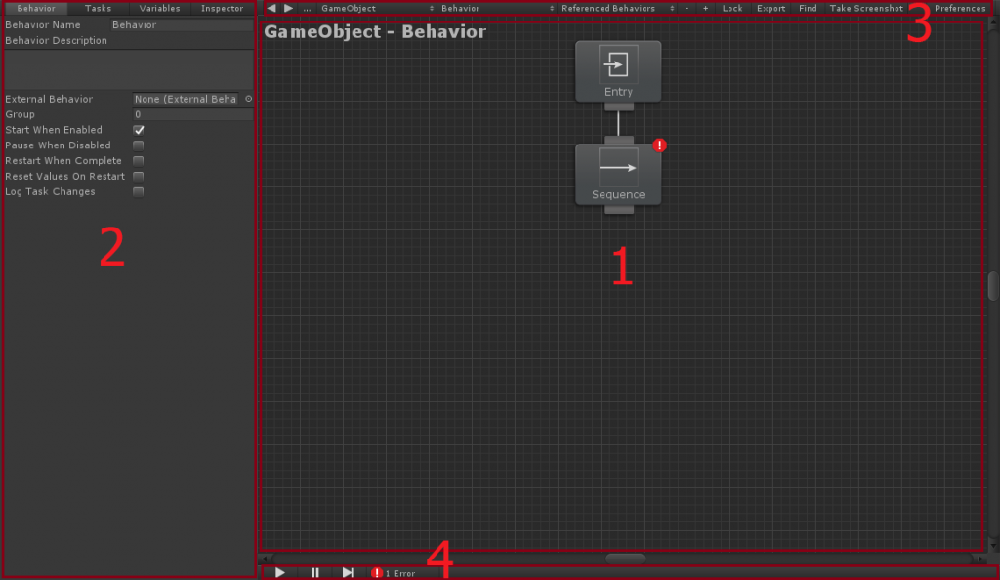
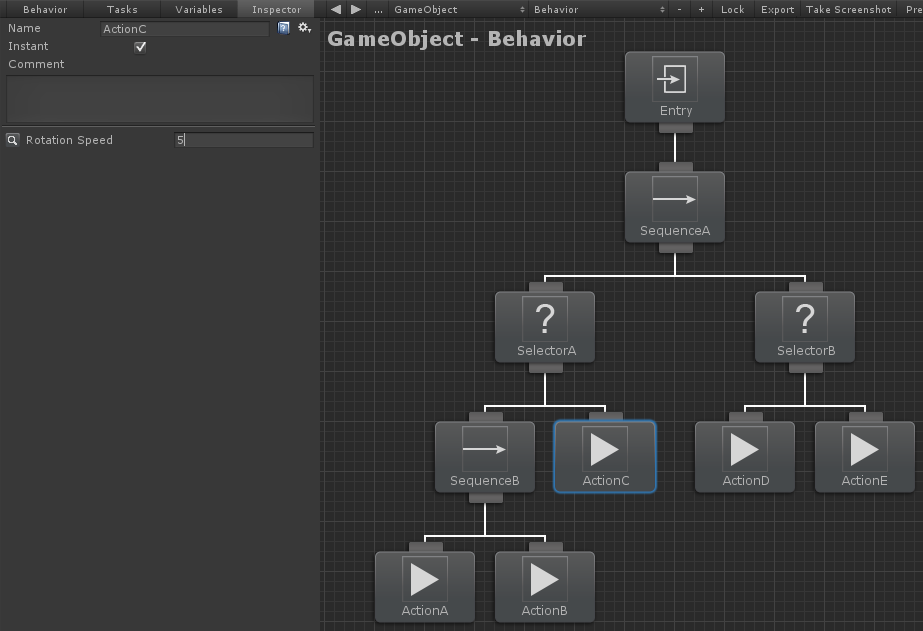
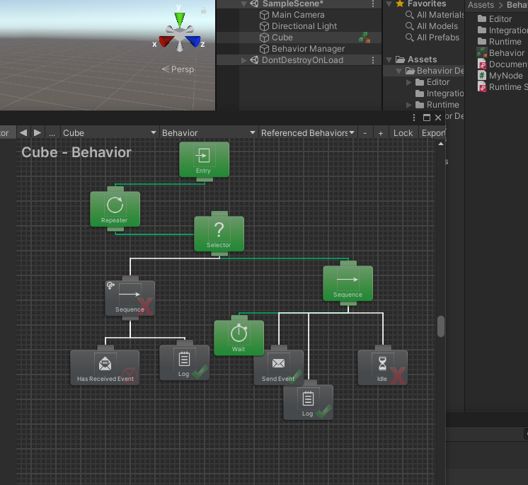

Behavior Designer插件

官方文档：https://opsive.com/support/documentation/behavior-designer/overview/

### 概述

### 初识行为树

添加行为树后，您就可以开始添加任务。通过右键单击图形区域或单击第 2 部分（属性面板）中的“任务”选项卡来添加任务。还可以通过按空格键并打开快速任务搜索窗口来添加新任务：

行为设计器将以深度优先的顺序执行任务。您可以通过将任务拖动到同级任务的左侧/右侧来更改任务的执行顺序。从上面的截图来看，任务将按以下顺序执行：

序列A、选择器A、序列B、动作A、动作B、动作C、选择器B、动作D、动作E

### 行为树或有限状态机

在什么情况下您会在有限状态机（例如 Playmaker）上使用行为树？在最高级别，行为树用于人工智能，而有限状态机（FSM）用于更通用的可视化编程。虽然您可以使用行为树进行一般可视化编程，使用有限状态机进行人工智能，但这并不是每个工具的设计目的。

与 FSM 相比，行为树有一些优势：它们提供了很大的灵活性，非常强大，而且很容易进行更改。

我们先来看第一个优点：灵活性。使用 FSM，如何同时运行两个不同的状态？唯一的方法是创建两个单独的 FSM。使用行为树，您需要做的就是添加并行任务，然后就完成了 - 所有子任务都将并行运行。使用行为设计器，这些子任务可以是 PlayMaker FSM，并且这些 FSM 将并行运行。

### 常用节点

- Sequence：顺序节点。从左到右，为真继续，为假则停，类似与逻辑
- Selector: 选择节点。从左到右，一真则真，一真即停，全假才假 
- Parallel：并行节点。并行执行，全真才真，一假即假，一假即停，被停即假
- Parallel Selector：并行选择节点。并行执行，全真才真，一假即假，一假即停，被停即假
- Random Selector：随机选择节点。随机选择节点，随机执行，一真即真，一真即停，全假才假
- Random Sequence：随机顺序节点。

**中断**

- Self中断
- Lower Priority中断（中断优先级比自己低的节点）
- Both中断

**自定义节点**

**事件节点**

