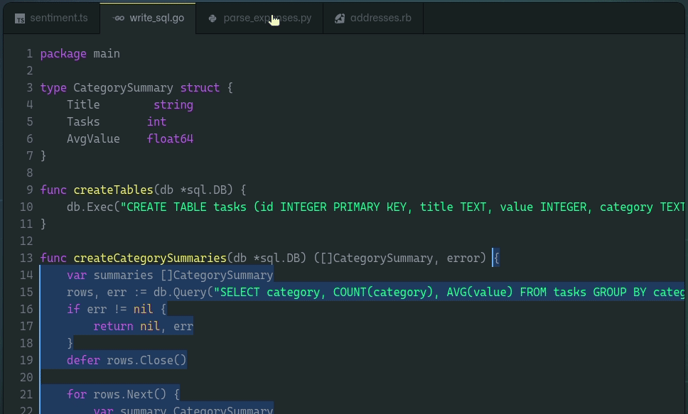

## [Codeium](https://blog.verysu.com/aritcle/tag/codeium) 


[Codeium](https://blog.verysu.com/aritcle/tag/codeium) 是一款免费、强大的 AI 智能编程助手，能够支持绝大部分主流编程语言和 IDE，每周会持续更新，具备快速响应和出色的代码建议能力。

利用 AI 技术，Codeium 能够学习用户的代码风格，快速补全代码，甚至在用户输入一段注释时，能自动生成相应代码，帮助用户提升开发效率，更快地开发高质量产品。





```cpp
//include some lib
#include <iostream>
// Create a main function
int main() {
    //print a message
    std::cout << "Hello World!" << std::endl;
    return 0;
}

//create a class with constructor
class Person{
    public:
        Person(std::string name);
        std::string getName();
    private:
        std::string name;
};

```


**用过都说好！！！**
