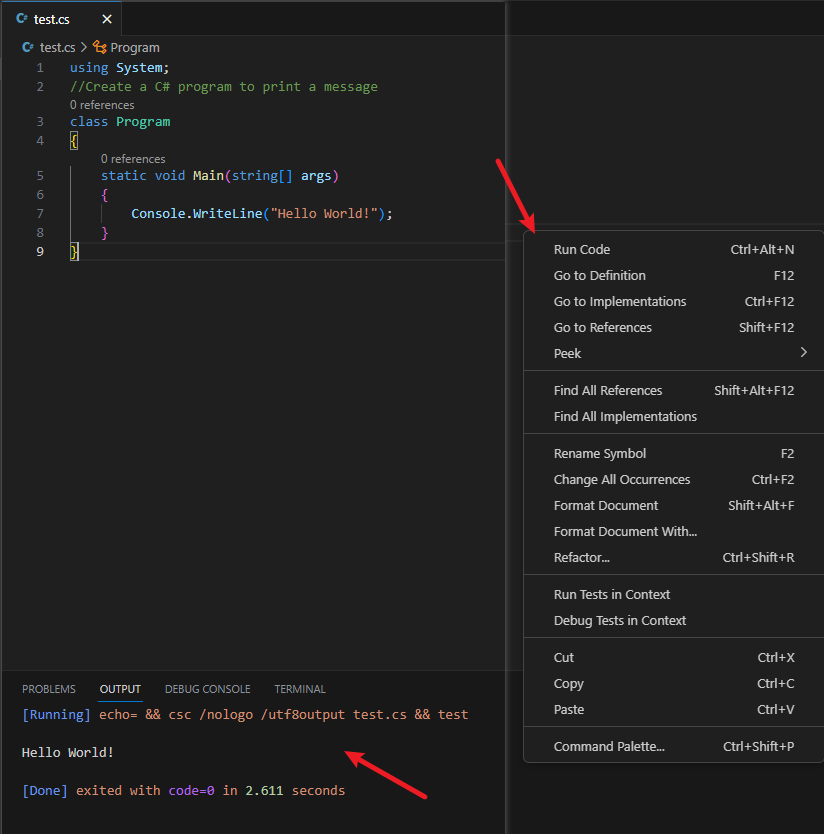

## 使用Code Runner在VS code中直接运行C#(.cs)文件


- 首先配置好.NET Framework环境变量 ：

（本例中将`C:\Windows\Microsoft.NET\Framework64\v4.0.30319`加入`Path`中即可）

- 在 *settings.json* 中加入：

```
"code-runner.executorMap": {
    "csharp": "echo= && csc /nologo /utf8output $fileName && $fileNameWithoutExt"
}
//
```



