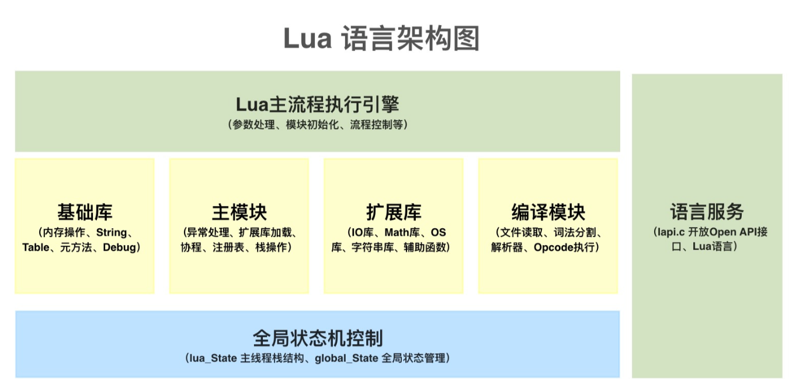
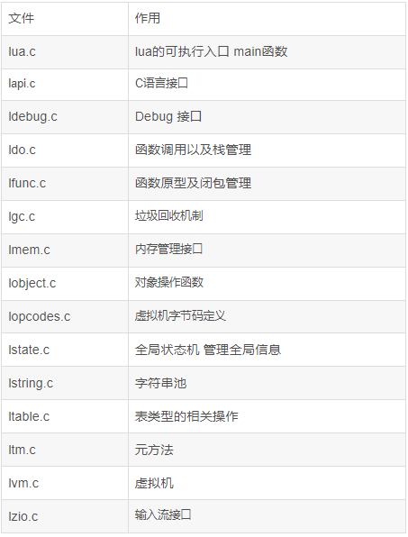
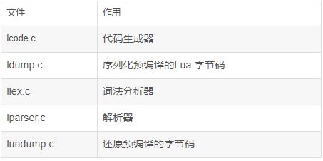
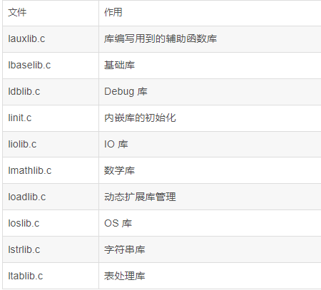

## Lua语言简介
Lua是一门用C语言编写的脚本语言，一共1w多行代码，非常的轻巧，适合做web脚本、游戏脚本、物联网等场景下使用。

Lua可以进行独立编程，但是大部分情况下是嵌入到大型语言里面，作为一个库，成为一种脚本编程语言存在。

## 引入

Lua 是一个小巧的脚本语言。它是巴西里约热内卢天主教大学（Pontifical Catholic University of Rio de Janeiro）里的一个由Roberto Ierusalimschy、Waldemar Celes 和 Luiz Henrique de Figueiredo三人所组成的研究小组于1993年开发的。 其设计目的是为了通过灵活嵌入应用程序中从而为应用程序提供灵活的扩展和定制功能。Lua由标准C编写而成，几乎在所有操作系统和平台上都可以编译，运行。Lua并没有提供强大的库，这是由它的定位决定的。所以Lua不适合作为开发独立应用程序的语言。Lua 有一个同时进行的JIT项目，提供在特定平台上的即时编译功能。

Lua是解释型语言，通过对Lua的语言进行语法解析，然后生成二进制字节码，然后转由C语言进行执行操作。编译型语言，则会进行编译后生成机器码，直接由机器进行执行即可，执行效率会比较高。

## Lua架构图

### Lua源码结构
Lua的下载地址：http://www.lua.org/

源码包下载后，我们可以看一下lua-5.3.5/src目录下的代码结构。代码结构基本会分3部分

**虚拟机核心功能部分**

**源代码解析和预编译**

**内嵌库**

每次阅读源码，其实最难的是开始，通过网上各种资料，先把lua的整个目录结构弄明白，幸好lua真的比较小，很容易就能弄明白每个文件是干什么的。接下去就是开始一点一点的啃整个源码的过程了。

啃整个lua语言链路解析过程之前，我会优先把lua周边的库以及虚拟机字节码这块搞明白，然后再开始进行整个解析流程的阅读。