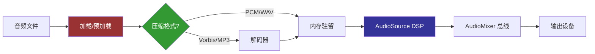

## 引言：为什么音频架构值得深度投入

游戏音频不是一个"贴上去就能跑"的系统。在大型项目中，音频系统面临以下核心挑战：

| 挑战 | 影响 | 工程复杂度 |
|------|------|-----------|
| 资源加载与内存管理 | 数百个音频文件同时就绪，内存峰值控制 | ★★★★ |
| 动态混合与层级路由 | 环境/UI/战斗/对话的实时优先级与音量平衡 | ★★★★★ |
| 程序化音效生成 | 减少资源包体积，实现参数驱动的动态音效 | ★★★★★ |
| 空间音频与HRTF | 3D 沉浸感的物理基础 | ★★★★ |
| 平台适配 | 从 PC 到手机到 WebGL 的音频管线差异 | ★★★★ |

本文将围绕**工程级音频系统**的设计，从底层原理出发，逐步构建一个可落地的技术方案。

```csharp
// 一个合格的音频系统应该满足的核心接口
public interface IAudioEngine
{
    // 加载与缓存
    Task<AudioClip> LoadClipAsync(string path, AudioLoadPriority priority);
    void UnloadUnused();
    
    // 播放控制
    AudioHandle Play(AudioRequest request);
    void StopAll(float fadeOutTime = 0f);
    void SetBusVolume(string busName, float volume);
    
    // 3D 空间化
    void SetListener(Transform listener);
    void UpdateSpatialization();
    
    // 动态分析
    float[] GetSpectrumData(int channel);
    float GetMasterPeakLevel();
}
```

---

## 一、Unity 音频管线底层剖析

### 1.1 音频数据流：从文件到扬声器

Unity 的音频管线分为**加载阶段 → 解码阶段 → 播放阶段**三个核心环节。



#### 加载模式详解

| 模式 | 加载时机 | 内存占用 | 适用场景 |
|------|---------|---------|---------|
| **Decompress on Load** | 场景加载时全部解压 | 高（PCM 展开） | 短音效/UI/角色语音 |
| **Compressed in Memory** | 加载时保持压缩 | 中（Vorbis 驻留） | 音乐/Ambient BGM |
| **Streaming** | 边播放边解码 | 低（逐块读取） | 长对白/播客类内容 |

```csharp
// 音频加载模式的工程级选择策略
public enum AudioLoadStrategy
{
    ImmediateDecompress,  // 短促关键音效
    MemoryCompressed,     // 循环 BGM
    Streaming             // 长篇语音
}

public static AudioLoadStrategy DetermineStrategy(AudioClip clip, float estimatedDuration)
{
    if (estimatedDuration < 2f)  return AudioLoadStrategy.ImmediateDecompress;
    if (estimatedDuration < 60f) return AudioLoadStrategy.MemoryCompressed;
    return AudioLoadStrategy.Streaming;
}
```

#### LoadType 的性能影响实测

```csharp
// Profiler 标记示例
using (new ProfilerMarker("AudioLoad.StrategyDecision").Auto())
{
    var strategy = DetermineStrategy(clip, clip.length);
    
    // 设置 Unity 内部加载模式
    switch (strategy)
    {
        case AudioLoadStrategy.ImmediateDecompress:
            clip.loadType = AudioClipLoadType.DecompressOnLoad;
            break;
        case AudioLoadStrategy.MemoryCompressed:
            clip.loadType = AudioClipLoadType.CompressedInMemory;
            break;
        case AudioLoadStrategy.Streaming:
            clip.loadType = AudioClipLoadType.Streaming;
            break;
    }
}
```

### 1.2 AudioMixer 的总线拓扑设计

音频总线(Bus)是混音的骨骼。合理设计总线层级是音频系统架构的第一步。

```
Master (0 dB)
├── BGM (+0 dB)        ← 背景音乐
│   ├── Ambient        ← 环境音（风声/雨声/水流）
│   └── Music          ← 旋律/主题音乐
├── SFX (+0 dB)         ← 音效组
│   ├── Weapon         ← 武器音效
│   ├── Footstep       ← 脚步声
│   ├── Ability        ← 技能/法术
│   └── UI             ← 界面交互
├── Voice (+3 dB)       ← 语音组（略作提升确保清晰度）
│   ├── Dialog         ← 对话
│   └── Narration      ← 旁白/提示语音
└── Reverb Bus          ← 混响发送组
    └── (各组的 Send 输出到此)
```

#### 工程级总线管理器实现

```csharp
using UnityEngine.Audio;
using System.Collections.Generic;

/// <summary>
/// 音频总线管理器：集中控制所有 Mixer 路由和快照切换
/// </summary>
public class AudioBusManager
{
    private readonly AudioMixer _mixer;
    private readonly Dictionary<string, string> _busPathCache = new();
    
    public AudioBusManager(AudioMixer mixer)
    {
        _mixer = mixer;
        // 预缓存所有总线路径
        CacheBusPaths();
    }
    
    private void CacheBusPaths()
    {
        // 基于约定：Exposed Parameters 命名为 "Volume_{BusName}"
        var params = new[] { "Master", "BGM", "SFX", "Voice", "Ambient", "Music", 
                             "Weapon", "Footstep", "Ability", "UI", "Dialog", "Narration" };
        foreach (var bus in params)
            _busPathCache[bus] = $"Volume_{bus}";
    }
    
    public void SetBusVolume(string busName, float linearVolume)
    {
        if (!_busPathCache.TryGetValue(busName, out var exposedParam)) return;
        
        // AudioMixer 使用 dB 单位，将线性音量 [0,1] 映射到 dB [-80, 0]
        float db = linearVolume < 0.001f ? -80f : Mathf.Log10(linearVolume) * 20f;
        _mixer.SetFloat(exposedParam, db);
        
        AudioVolumeChanged?.Invoke(busName, linearVolume, db);
    }
    
    public float GetBusVolume(string busName)
    {
        if (!_busPathCache.TryGetValue(busName, out var exposedParam)) return 0f;
        
        if (_mixer.GetFloat(exposedParam, out float db))
            return Mathf.Pow(10f, db / 20f);
        return 0f;
    }
    
    /// <summary>
    /// 平滑过渡到指定快照
    /// </summary>
    public void TransitionToSnapshot(string snapshotName, float transitionTime = 0.5f)
    {
        var snapshot = _mixer.FindSnapshot(snapshotName);
        if (snapshot != null)
            snapshot.TransitionTo(transitionTime);
    }
    
    public event System.Action<string, float, float> AudioVolumeChanged;
}
```

---

## 二、程序化音效合成引擎的设计与实现

程序化音效的核心价值在于：**用代码代替音频文件**，实现参数驱动的动态音效生成。这在以下场景中尤其重要：

- 开放世界的环境音（风/雨/火/水）需要无限变化
- 武器音效根据材质/力量/速度动态变化
- 减少 App 包体积（一个合成器 ≈ 20+ 音频文件）

### 2.1 基于 OnAudioFilterRead 的实时音频合成

Unity 的 `OnAudioFilterRead` 回调允许我们直接操作音频缓冲区，是实现程序化音效的核心入口。

```csharp
using UnityEngine;

/// <summary>
/// 基础信号生成器：方波/锯齿波/正弦波/噪声
/// </summary>
[RequireComponent(typeof(AudioSource))]
public class ProceduralWaveGenerator : MonoBehaviour
{
    [Header("波形参数")]
    public WaveType waveType = WaveType.Sine;
    [Range(20f, 8000f)] public float frequency = 440f;
    [Range(0f, 1f)] public float amplitude = 0.5f;
    
    private float _phase;
    private int _sampleRate;
    
    public enum WaveType { Sine, Square, Sawtooth, Triangle, Noise }
    
    void Awake()
    {
        _sampleRate = AudioSettings.outputSampleRate;
    }
    
    void OnAudioFilterRead(float[] data, int channels)
    {
        for (int i = 0; i < data.Length; i += channels)
        {
            float sample = GenerateSample(waveType, _phase);
            sample *= amplitude;
            
            // 写入所有通道
            for (int c = 0; c < channels; c++)
                data[i + c] = sample;
            
            // 相位累进
            _phase += frequency / _sampleRate;
            if (_phase >= 1f) _phase -= 1f;
        }
    }
    
    private static float GenerateSample(WaveType type, float phase)
    {
        return type switch
        {
            WaveType.Sine     => Mathf.Sin(phase * Mathf.PI * 2f),
            WaveType.Square   => phase < 0.5f ? 1f : -1f,
            WaveType.Sawtooth => 2f * phase - 1f,
            WaveType.Triangle => 4f * Mathf.Abs(phase - 0.5f) - 1f,
            WaveType.Noise    => Random.Range(-1f, 1f),
            _ => 0f
        };
    }
}
```

### 2.2 程序化引擎合成架构

真正的程序化音效引擎远比简单波形生成复杂。我们需要一个**图灵完备的信号处理管线**。

```csharp
/// <summary>
/// 程序化音效合成节点基础接口
/// </summary>
public interface ISynthNode : IDisposable
{
    /// <summary>
    /// 处理输入缓冲区，产生或修改音频数据
    /// </summary>
    void Process(float[] buffer, int channels);
    
    /// <summary>
    /// 节点状态重置
    /// </summary>
    void Reset();
    
    bool IsActive { get; }
}

/// <summary>
/// ADSR 包络控制器
/// </summary>
public class ADSREnvelope : ISynthNode
{
    public enum State { Idle, Attack, Decay, Sustain, Release }
    
    private State _currentState = State.Idle;
    private float _currentAmplitude;
    private float _sampleRate;
    
    public float AttackTime  { get; set; } = 0.01f;   // 秒
    public float DecayTime   { get; set; } = 0.1f;    // 秒
    public float SustainLevel { get; set; } = 0.7f;
    public float ReleaseTime { get; set; } = 0.3f;    // 秒
    
    public ADSREnvelope()
    {
        _sampleRate = AudioSettings.outputSampleRate;
    }
    
    public void Process(float[] buffer, int channels)
    {
        if (_currentState == State.Idle) return;
        
        for (int i = 0; i < buffer.Length; i += channels)
        {
            _currentAmplitude = ComputeEnvelope();
            
            // 应用到所有通道
            for (int c = 0; c < channels; c++)
                buffer[i + c] *= _currentAmplitude;
            
            if (_currentState == State.Release && _currentAmplitude < 0.001f)
                _currentState = State.Idle;
        }
    }
    
    private float ComputeEnvelope()
    {
        float delta = 1f / _sampleRate;
        
        switch (_currentState)
        {
            case State.Attack:
                _currentAmplitude += delta / AttackTime;
                if (_currentAmplitude >= 1f)
                {
                    _currentAmplitude = 1f;
                    _currentState = State.Decay;
                }
                return _currentAmplitude;
                
            case State.Decay:
                _currentAmplitude -= delta / DecayTime * (1f - SustainLevel);
                if (_currentAmplitude <= SustainLevel)
                {
                    _currentAmplitude = SustainLevel;
                    _currentState = State.Sustain;
                }
                return _currentAmplitude;
                
            case State.Sustain:
                return SustainLevel;
                
            case State.Release:
                return _currentAmplitude - (delta / ReleaseTime) * _currentAmplitude;
                
            default:
                return 0f;
        }
    }
    
    public void NoteOn()
    {
        _currentState = State.Attack;
        _currentAmplitude = 0f;
    }
    
    public void NoteOff()
    {
        if (_currentState != State.Idle)
            _currentState = State.Release;
    }
    
    public void Reset()
    {
        _currentState = State.Idle;
        _currentAmplitude = 0f;
    }
    
    public bool IsActive => _currentState != State.Idle;
    
    public void Dispose() { }
}
```

### 2.3 完整火焰音效合成器实战

```csharp
/// <summary>
/// 程序化火焰音效合成器
/// 由多层噪声 + 随机滤波组成，模拟火焰噼啪声
/// </summary>
public class FireAudioSynth : MonoBehaviour
{
    [Header("火焰参数")]
    [Range(0.1f, 2f)] public float intensity = 1f;
    [Range(0f, 1f)]   public windFactor = 0.3f;
    
    private float _phase1, _phase2, _phase3;
    private int _sampleRate;
    private float _crackleTimer;
    
    void Awake() => _sampleRate = AudioSettings.outputSampleRate;
    
    void OnAudioFilterRead(float[] data, int channels)
    {
        for (int i = 0; i < data.Length; i += channels)
        {
            // 3 层噪声叠加
            float white = Random.Range(-1f, 1f);
            float brown = GenerateBrownNoise(ref _phase1, 0.95f);
            float lowRumble = GenerateSine(ref _phase2, 60f * intensity);
            
            // 主火焰噪声：white 经过低频调制
            float fire = white * (0.3f + 0.7f * (0.5f + 0.5f * GenerateSine(ref _phase3, 
                2f + intensity * 3f)));
            
            // 噼啪声随机触发
            _crackleTimer -= 1f / _sampleRate;
            float crackle = 0f;
            if (_crackleTimer <= 0f && Random.value < 0.3f * intensity)
            {
                crackle = Random.Range(-1f, 1f) * 0.6f;
                _crackleTimer = Random.Range(0.1f, 0.5f);
            }
            
            // 混合
            float sample = fire * 0.5f + brown * 0.3f + lowRumble * 0.15f + crackle;
            sample = Mathf.Clamp(sample, -1f, 1f);
            sample *= 0.3f * intensity;
            
            for (int c = 0; c < channels; c++)
                data[i + c] = sample;
        }
    }
    
    private float GenerateBrownNoise(ref float phase, float decay)
    {
        phase = phase * decay + Random.Range(-1f, 1f) * (1f - decay);
        return Mathf.Clamp(phase, -1f, 1f);
    }
    
    private float GenerateSine(ref float phase, float freq)
    {
        phase += freq / _sampleRate;
        if (phase > 1f) phase -= 1f;
        return Mathf.Sin(phase * Mathf.PI * 2f);
    }
}
```

---

## 三、Wwise/FMOD 中间件集成架构

在大型项目中，原生 Unity 音频系统往往不够用。Wwise 和 FMOD 提供了专业级音频管线。

### 3.1 抽象音频后端层

通过接口抽象，我们可以实现**运行时切换后端**，Unity 原生 vs Wwise vs FMOD。

```csharp
/// <summary>
/// 音频后端抽象层 —— 允许在 Unity Native / Wwise / FMOD 之间切换
/// </summary>
public interface IAudioBackend : IDisposable
{
    string Name { get; }
    
    // 初始化
    bool Initialize(string projectPath);
    
    // 声音资源管理
    AudioAssetId LoadAsset(string assetName);
    void UnloadAsset(AudioAssetId id);
    
    // 播放
    PlaybackId Play(AudioAssetId asset, PlaybackConfig config);
    void Stop(PlaybackId id, float fadeOut);
    void Pause(PlaybackId id);
    void Resume(PlaybackId id);
    
    // 3D 空间化
    void SetListenerPosition(Vector3 pos, Quaternion rot);
    void SetEmitterPosition(PlaybackId id, Vector3 pos);
    
    // 总线控制
    void SetBusVolume(string busPath, float volume);
    
    // 游戏同步
    void SetGlobalParameter(string param, float value);
    void PostEvent(string eventName, GameObject target = null);
    
    // 内存/性能
    long GetMemoryUsage();
    void Update(); // 每帧调用
}
```

### 3.2 Wwise 集成适配器示例

```csharp
#if USE_WWISE
using AK.Wwise;

/// <summary>
/// Wwise 后端适配器
/// </summary>
public class WwiseAudioBackend : IAudioBackend
{
    public string Name => "Wwise";
    
    private readonly Dictionary<AudioAssetId, Bank> _banks = new();
    private readonly Dictionary<PlaybackId, uint> _playingIds = new();
    private ulong _nextAssetId = 1;
    
    public bool Initialize(string projectPath)
    {
        // Wwise 初始化通常由 AkInitializer 完成
        // 此处只需验证 AkSoundEngine 状态
        return AkSoundEngine.IsInitialized();
    }
    
    public AudioAssetId LoadAsset(string assetName)
    {
        var bank = new Bank();
        var result = bank.Load(assetName);
        
        if (result == AKRESULT.AK_Success)
        {
            var id = new AudioAssetId(_nextAssetId++);
            _banks[id] = bank;
            return id;
        }
        
        Debug.LogError($"[Wwise] 加载 Bank 失败: {assetName}, result={result}");
        return AudioAssetId.Invalid;
    }
    
    public PlaybackId Play(AudioAssetId asset, PlaybackConfig config)
    {
        if (!_banks.TryGetValue(asset, out var bank)) 
            return PlaybackId.Invalid;
        
        uint playingId = AkSoundEngine.PostEvent(
            config.EventName,
            config.TargetObject ?? Camera.main?.gameObject,
            (uint)AkCallbackType.AK_EndOfEvent,
            OnAudioEventCallback,
            null
        );
        
        var playbackId = new PlaybackId((int)playingId);
        _playingIds[playbackId] = playingId;
        return playbackId;
    }
    
    private void OnAudioEventCallback(object cookie, AkCallbackType type, AkCallbackInfo info)
    {
        if (type == AkCallbackType.AK_EndOfEvent)
        {
            // 清理已结束的播放
            var playingId = new PlaybackId((int)info.playingID);
            _playingIds.Remove(playingId);
        }
    }
    
    public void Stop(PlaybackId id, float fadeOut)
    {
        if (_playingIds.TryGetValue(id, out uint playingId))
            AkSoundEngine.ExecuteActionOnPlayingID(
                AKActionOnEventType.AK_ActionOnEventType_Stop, 
                playingId, 
                (int)(fadeOut * 1000f), 
                AkCurveInterpolation.AkCurveInterpolation_Sine
            );
    }
    
    public void SetBusVolume(string busPath, float volume)
    {
        AkSoundEngine.SetRTPCValue(busPath, volume * 100f);
    }
    
    public void SetGlobalParameter(string param, float value)
    {
        AkSoundEngine.SetRTPCValue(param, value);
    }
    
    public void Update()
    {
        // Wwise 需要每帧调用
        AkSoundEngine.RenderAudio();
    }
    
    // ... 其他接口实现省略
}
#endif
```

---

## 四、空间音频与 HRTF 深度实践

### 4.1 3D 音频衰减模型的选择

Unity 提供三种衰减模式，各有不同的物理模型：

| 模型 | 公式 | 适用场景 |
|------|------|---------|
| **Logarithmic** | `V = 1 - log(d/d_ref) / log(d_max/d_ref)` | 真实物理模拟 |
| **Linear** | `V = 1 - (d - d_ref) / (d_max - d_ref)` | 游戏性优先 |
| **Custom** | 自定义 AnimationCurve | 艺术性调整 |

```csharp
/// <summary>
/// 3D 音频衰减自定义曲线生成器
/// 根据距离生成精确的衰减曲线
/// </summary>
public static class SpatialAudioCurveGenerator
{
    public static AnimationCurve GenerateInverseSquareCurve(float minDist, float maxDist)
    {
        var keys = new Keyframe[32];
        for (int i = 0; i < keys.Length; i++)
        {
            float t = i / (float)(keys.Length - 1);
            float dist = Mathf.Lerp(minDist, maxDist, t);
            
            // 平方反比衰减 + 最小音量保护
            float volume = 1f / (1f + dist * dist * 0.1f);
            volume = Mathf.Max(volume, 0.01f);
            
            keys[i] = new Keyframe(dist, volume);
        }
        return new AnimationCurve(keys);
    }
    
    public static void ApplyToSource(AudioSource source, float minDist, float maxDist)
    {
        source.rolloffMode = AudioRolloffMode.Custom;
        source.minDistance = minDist;
        source.maxDistance = maxDist;
        source.SetCustomCurve(AudioSourceCurveType.CustomRolloff, 
            GenerateInverseSquareCurve(minDist, maxDist));
    }
}
```

### 4.2 实战：HRTF 空间滤波实现

HRTF（头部相关传输函数）是让音频在 3D 空间中"定位精准"的核心技术。

```csharp
/// <summary>
/// 简易 HRTF 空间滤波处理器
/// 基于角度对音频进行高通/低通滤波模拟耳廓遮挡效应
/// </summary>
public class SimpleHRTFFilter : MonoBehaviour
{
    [Header("HRTF 参数")]
    public AudioSource targetSource;
    public Transform listener;
    
    [Range(100f, 5000f)] 
    public float minCutoffFreq = 800f;   // 后方截止频率
    
    [Range(5000f, 22000f)] 
    public float maxCutoffFreq = 18000f; // 前方截止频率
    
    private AudioLowPassFilter _lowPass;
    private float _targetCutoff;
    
    void Start()
    {
        _lowPass = targetSource.gameObject.AddComponent<AudioLowPassFilter>();
        if (listener == null) 
            listener = Camera.main?.transform;
    }
    
    void Update()
    {
        if (listener == null || targetSource == null) return;
        
        // 计算音源相对于听者的方向
        Vector3 dirToSource = (targetSource.transform.position - listener.position).normalized;
        float angle = Vector3.Angle(listener.forward, dirToSource);
        
        // 前方 (0°) 不过滤，后方 (180°) 最大低通
        // 同时加入仰角遮挡效应
        float elevationFactor = Mathf.Clamp01(Mathf.Abs(dirToSource.y) * 2f);
        
        // 计算混合因子
        float occlusion = Mathf.Sin(angle * Mathf.Deg2Rad * 0.5f);
        occlusion = Mathf.Lerp(occlusion, 1f, elevationFactor * 0.4f);
        
        _targetCutoff = Mathf.Lerp(maxCutoffFreq, minCutoffFreq, occlusion);
        
        // 平滑过渡避免突兀
        _lowPass.cutoffFrequency = Mathf.Lerp(
            _lowPass.cutoffFrequency, 
            _targetCutoff, 
            Time.deltaTime * 10f
        );
    }
}
```

---

## 五、WebGL 音频兼容性深度适配

WebGL 平台的音频系统是 Unity 开发中的"暗礁"——限制极多且不易排查。

### 5.1 WebAudio 限制与工程对策

| 限制 | 根本原因 | 对策 |
|------|---------|------|
| **用户交互后才能播放** | 浏览器自动播放政策 | 预创建 AudioContext + 用户手势解锁 |
| **音频文件必须预加载** | Web 流式加载限制 | 在场景加载时预解码全部短音效 |
| **音频池数量限制** | WebAudio 最大 AudioSource 限制 | 实现 LRU 回收池 |
| **无硬件 3D 音频** | WebAudio PannerNode 精度有限 | 软件模拟 HRTF |
| **Wwise 不可用** | 需要 Native Plugin | 回退到 Unity Native + WebAudio |

### 5.2 WebGL 音频管理器实现

```csharp
/// <summary>
/// WebGL 专属音频管理器 —— 处理浏览器自动播放政策和资源限制
/// </summary>
public class WebGLAudioManager : MonoBehaviour
{
    private bool _userInteracted = false;
    private readonly Queue<AudioSource> _sourcePool = new();
    private readonly Dictionary<string, AudioClip> _preloadedClips = new();
    
    [Header("WebGL 配置")]
    [SerializeField] private int poolSize = 32;
    [SerializeField] private string[] preloadClipPaths;
    
    void Start()
    {
        // 浏览器自动播放政策：必须在用户手势之后才能播放
        InitializePool();
        StartCoroutine(WaitForUserInteraction());
        
        // 预加载所有必要音效
        if (Application.platform == RuntimePlatform.WebGLPlayer)
            StartCoroutine(PreloadAllClips());
    }
    
    private IEnumerator WaitForUserInteraction()
    {
        // 在 WebGL 上，任何按钮点击或触摸事件都可触发
        while (!_userInteracted)
        {
            if (Input.anyKeyDown || Input.touchCount > 0 || Input.GetMouseButtonDown(0))
            {
                _userInteracted = true;
                
                // 播放一个静音样本以激活 AudioContext
                PlaySilentBuffer();
                
                OnAudioContextReady?.Invoke();
            }
            yield return null;
        }
    }
    
    /// <summary>
    /// 播放极短的静音样本以解锁 AudioContext
    /// </summary>
    [System.Runtime.InteropServices.DllImport("__Internal")]
    private static extern void WebGLAudioUnlock();
    
    private void PlaySilentBuffer()
    {
#if UNITY_WEBGL && !UNITY_EDITOR
        WebGLAudioUnlock();
#endif
        AudioSource.PlayClipAtPoint(CreateSilentClip(), Vector3.zero);
    }
    
    private AudioClip CreateSilentClip()
    {
        var samples = new float[1024]; // 约 23ms 静音
        var clip = AudioClip.Create("SilentUnlock", samples.Length, 1, 
            AudioSettings.outputSampleRate, false);
        clip.SetData(samples, 0);
        return clip;
    }
    
    private void InitializePool()
    {
        for (int i = 0; i < poolSize; i++)
        {
            var go = new GameObject($"AudioPool_{i}");
            go.transform.parent = transform;
            var source = go.AddComponent<AudioSource>();
            source.playOnAwake = false;
            go.SetActive(false);
            _sourcePool.Enqueue(source);
        }
    }
    
    public AudioSource RequestSource()
    {
        if (!_userInteracted) return null;
        
        if (_sourcePool.Count > 0)
        {
            var source = _sourcePool.Dequeue();
            source.gameObject.SetActive(true);
            return source;
        }
        
        // 池满时回收最旧的源
        return null;
    }
    
    public void ReturnSource(AudioSource source)
    {
        source.Stop();
        source.clip = null;
        source.gameObject.SetActive(false);
        _sourcePool.Enqueue(source);
    }
    
    private IEnumerator PreloadAllClips()
    {
        foreach (var path in preloadClipPaths)
        {
            var request = Resources.LoadAsync<AudioClip>(path);
            yield return request;
            
            if (request.asset is AudioClip clip)
            {
                // 强制解压确保播放无延迟
                clip.LoadAudioData();
                _preloadedClips[path] = clip;
            }
        }
    }
    
    public event System.Action OnAudioContextReady;
}
```

---

## 六、动态音频分析与可视化

### 6.1 频谱分析工具

```csharp
/// <summary>
/// 实时频谱分析器 —— 可用于音游、可视化、节奏检测
/// </summary>
public class AudioSpectrumAnalyzer : MonoBehaviour
{
    public enum Channel { Left, Right, Stereo }
    
    [Header("分析配置")]
    public FFTWindow fftWindow = FFTWindow.BlackmanHarris;
    public int spectrumSize = 1024; // 必须是 2 的幂
    public Channel targetChannel = Channel.Stereo;
    
    [Header("输出")]
    public float[] spectrumData;
    public float[] bandData;      // 8 个频段
    public float peakLevel;
    public float rmsLevel;
    
    private AudioSource _source;
    
    // 频段划分 (Hz)
    private static readonly float[] BandFrequencies = 
        { 60, 250, 500, 1000, 2000, 4000, 8000, 16000 };
    
    void Start()
    {
        _source = GetComponent<AudioSource>();
        spectrumData = new float[spectrumSize];
        bandData = new float[BandFrequencies.Length];
    }
    
    void Update()
    {
        if (_source == null || !_source.isPlaying) return;
        
        int channel = targetChannel switch
        {
            Channel.Left  => 0,
            Channel.Right => 1,
            _ => 0
        };
        
        _source.GetSpectrumData(spectrumData, channel, fftWindow);
        
        // 计算频段能量
        int sampleRate = AudioSettings.outputSampleRate;
        float freqPerBin = sampleRate / 2f / spectrumSize;
        
        for (int b = 0; b < BandFrequencies.Length; b++)
        {
            float targetFreq = BandFrequencies[b];
            int binIndex = Mathf.FloorToInt(targetFreq / freqPerBin);
            
            if (binIndex < spectrumSize)
                bandData[b] = spectrumData[binIndex];
            else
                bandData[b] = 0f;
        }
        
        // 峰值与 RMS
        rmsLevel = 0f;
        peakLevel = 0f;
        for (int i = 0; i < spectrumSize; i++)
        {
            rmsLevel += spectrumData[i] * spectrumData[i];
            if (spectrumData[i] > peakLevel)
                peakLevel = spectrumData[i];
        }
        rmsLevel = Mathf.Sqrt(rmsLevel / spectrumSize);
    }
    
    /// <summary>
    /// 低频能量检测 —— 用于打击感触发
    /// </summary>
    public bool DetectBassHit(float threshold = 0.5f)
    {
        // 检查 60-250Hz 频段能量
        return bandData[0] + bandData[1] > threshold;
    }
    
    /// <summary>
    /// 节奏检测 —— 基于能量突增
    /// </summary>
    public bool DetectBeat(float sensitivity = 1.5f)
    {
        float currentEnergy = bandData[0] + bandData[1];
        float averageEnergy = 0f;
        
        // 维护历史能量队列
        _energyHistory.Enqueue(currentEnergy);
        if (_energyHistory.Count > 43) // 约 1 秒 (60bpm 约 43 帧)
            _energyHistory.Dequeue();
        
        averageEnergy = _energyHistory.Average();
        
        return currentEnergy > averageEnergy * sensitivity;
    }
    
    private readonly Queue<float> _energyHistory = new(43);
}
```

---

## 七、音频性能优化体系

### 7.1 内存与 CPU 优化清单

```
┌─────────────────────────────────────────────────┐
│              音频性能优化清单                       │
├─────────────────────────────────────────────────┤
│ CPU 端                                             │
│  □ 短音效( <2s ) → DecompressOnLoad               │
│  □ 长音效( >10s ) → Streaming                     │
│  □ 禁用不需要的 3D 音效的 SpatialBlend             │
│  □ 限制同时播放数: SFX=24 / Voice=8 / BGM=2       │
│  □ 使用 AudioMixer 取代脚本逐帧控制音量              │
├─────────────────────────────────────────────────┤
│ 内存端                                             │
│  □ 音乐文件使用 Vorbis @ quality=0.5-0.7           │
│  □ 语音文件使用 ADPCM 压缩                          │
│  □ 音效文件使用 Vorbis @ quality=0.7-0.9           │
│  □ 大世界按区域分块加载音频资源                      │
│  □ 运行时 UnloadUnusedAudioAssets()                 │
├─────────────────────────────────────────────────┤
│ GPU 端                                             │
│  □ 频谱可视化使用 Job System 而非主线程              │
│  □ FFT 计算使用 Burst Compiler                     │
└─────────────────────────────────────────────────┘
```

### 7.2 智能音频优先级调度

```csharp
/// <summary>
/// 音频优先级调度器 —— 超出同时播放数时智能降级/终止
/// </summary>
public class AudioPriorityScheduler
{
    public enum AudioCategory
    {
        Critical,     // 关键对话/提示 —— 必须播放
        Important,    // 武器/技能音效 —— 优先保留
        Normal,       // 脚步/环境 —— 可被覆盖
        Background    // 低频环境/细节 —— 最先被移除
    }
    
    private class ActiveAudio
    {
        public AudioHandle Handle;
        public AudioCategory Category;
        public float ImportanceScore;
        public float PlayedDuration;
        public bool IsLooping;
    }
    
    private readonly Dictionary<AudioCategory, int> _maxCounts = new()
    {
        [AudioCategory.Critical]    = 4,
        [AudioCategory.Important]   = 8,
        [AudioCategory.Normal]      = 16,
        [AudioCategory.Background]  = 8
    };
    
    private readonly List<ActiveAudio> _activeAudios = new();
    private readonly int _totalMax = 24; // 总上限
    
    public bool TrySchedule(AudioHandle handle, AudioCategory category, 
        float distancePriority = 1f)
    {
        // 1. 检查分类上限
        var categoryCount = _activeAudios.Count(a => a.Category == category);
        if (categoryCount < _maxCounts[category])
        {
            if (_activeAudios.Count < _totalMax)
            {
                AddAudio(handle, category, distancePriority);
                return true;
            }
            
            // 2. 超出总数上限 —— 尝试驱逐低优先级
            var lowest = FindLowestPriorityAudio();
            if (lowest != null && lowest.ImportanceScore < distancePriority)
            {
                RemoveAudio(lowest);
                AddAudio(handle, category, distancePriority);
                return true;
            }
            return false;
        }
        
        // 3. 超出分类上限 —— 驱逐同分类最低优先级的
        var lowestInCategory = _activeAudios
            .Where(a => a.Category == category)
            .OrderBy(a => a.ImportanceScore)
            .FirstOrDefault();
            
        if (lowestInCategory != null && !lowestInCategory.IsLooping)
        {
            RemoveAudio(lowestInCategory);
            AddAudio(handle, category, distancePriority);
            return true;
        }
        
        return false;
    }
    
    private ActiveAudio FindLowestPriorityAudio()
    {
        return _activeAudios
            .Where(a => !a.IsLooping)
            .OrderBy(a => a.Category) // Background 优先
            .ThenBy(a => a.ImportanceScore)
            .FirstOrDefault();
    }
    
    private void AddAudio(AudioHandle handle, AudioCategory category, float score)
    {
        _activeAudios.Add(new ActiveAudio
        {
            Handle = handle,
            Category = category,
            ImportanceScore = score,
            PlayedDuration = 0f,
            IsLooping = handle.IsLooping
        });
    }
    
    private void RemoveAudio(ActiveAudio audio)
    {
        audio.Handle.Stop(fadeOut: 0.15f);
        _activeAudios.Remove(audio);
    }
}
```

---

## 八、最佳实践总结

### 8.1 架构设计原则

1. **接口分离原则**：将音频播放与业务逻辑解耦，通过事件驱动而非直接调用
2. **统一音频入口**：所有播放请求通过 `AudioManager.Instance.Play()` 路由
3. **后端抽象**：预留 Wwise/FMOD 适配层，避免深度耦合 Unity API
4. **池化管理**：AudioSource 池 + 音频剪辑缓存池，避免运行时频繁创建
5. **异步加载**：利用 Addressables 实现按需加载和依赖管理

### 8.2 性能红线

```csharp
/// <summary>
/// 音频系统性能监控 —— 开发期自动告警
/// </summary>
public static class AudioPerformanceGuard
{
    // 每帧允许的最大音频操作时间 (ms)
    private const float MaxAudioProcessingTimeMs = 0.5f;
    private const int MaxActiveSourcesWebGL = 24;
    private const int MaxActiveSourcesStandalone = 48;
    
    private static float _lastFrameTime;
    
    [System.Diagnostics.Conditional("UNITY_EDITOR")]
    public static void CheckPerformance()
    {
        float currentTime = Time.realtimeSinceStartup;
        float delta = currentTime - _lastFrameTime;
        _lastFrameTime = currentTime;
        
        if (delta > MaxAudioProcessingTimeMs * 0.001f)
            Debug.LogWarning($"[音频性能告警] 音频处理耗时 {delta * 1000:F1}ms，超出红线");
        
        int activeCount = 0;
        var sources = FindObjectsByType<AudioSource>(FindObjectsSortMode.None);
        foreach (var s in sources)
            if (s.isPlaying) activeCount++;
        
        int limit = Application.platform == RuntimePlatform.WebGLPlayer 
            ? MaxActiveSourcesWebGL : MaxActiveSourcesStandalone;
            
        if (activeCount > limit)
            Debug.LogWarning($"[音频性能告警] 同时播放 {activeCount} 个音源，超过 {limit}");
    }
}
```

### 8.3 快速排查流

当音频系统出现问题时，按以下路径排查：

1. **不发声 →** 检查 AudioListener 是否激活 → 检查 Master Volume → 检查 AudioMixer 是否挂载
2. **断续/跳音 →** 检查 LoadType 是否为 Streaming → 检查是否有磁盘 IO 瓶颈
3. **3D 定位不准 →** 检查 SpatialBlend 是否为 1.0 → 检查 HRTF 滤波器参数
4. **内存过高 →** 检查是否有大量 DecompressOnLoad 的长音效 → 检查是否有泄漏的 AudioSource
5. **WebGL 不播放 →** 确认用户交互后才播放 → 检查音频池大小 → 确认文件格式为 MP3/Ogg

---

*本文从 Unity 音频管线底层原理出发，系统性地讲解了音频系统架构设计的核心问题：从资源加载策略、AudioMixer 总线拓扑、程序化音效合成引擎，到 Wwise 中间件集成、空间音频 HRTF 实践、WebGL 兼容性适配，以及最终的性能优化体系。音频是游戏沉浸感的"另一半"，值得像渲染和物理一样被认真对待。*
