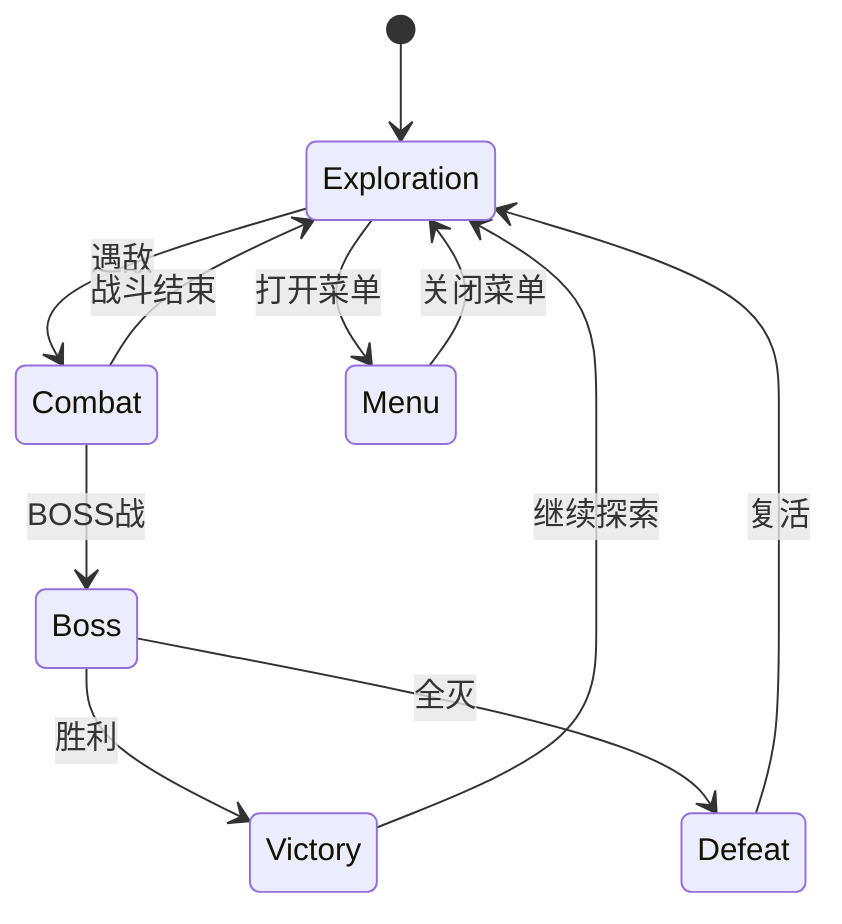

# Unity游戏音频系统深度实践：从FMOD/Wwise集成到程序化音频引擎

## 一、引言：为什么游戏音频需要系统工程化

在手游开发中，音频模块往往是「最后一公里」的问题——功能上能响就行，性能上不崩就行。但对于一款追求品质的商业化项目，音频系统需要和渲染管线、网络同步一样，拥有清晰的架构设计、完善的资源管理和严格的性能预算。

一个成熟的游戏音频系统需要解决以下挑战：

- **资源管理**：数十GB的音频资源如何按场景/状态动态加载卸载
- **3D空间化**：在移动端有限的CPU预算内实现准确的空间音频
- **动态混音**：根据游戏状态（战斗/剧情/大厅）实时切换混音配置
- **性能开销**：音频解码、DSP处理对CPU和内存的占用控制
- **多平台适配**：iOS/Android/PC不同音频API的统一封装

本文将从底层原理到工程实践，系统性地探讨游戏音频架构设计。

---

## 二、Unity音频管线底层原理

### 2.1 Unity音频系统架构总览

Unity的音频管线分为三层：

```
┌────────────────────────────────────────────┐
│            Game Logic Layer                │
│  AudioSource.Play() / AudioMixer.SetFloat() │
├────────────────────────────────────────────┤
│         Audio Manager / 中间件层           │
│   Wwise / FMOD / Fabric / 自研管理器       │
├────────────────────────────────────────────┤
│          Unity Audio Engine 核心           │
│  AudioSystem → FMOD(低阶) → 平台音频API    │
└────────────────────────────────────────────┘
```

底层实际上，Unity的内建音频系统也是基于FMOD的。了解这一点对于性能优化至关重要。

### 2.2 AudioClip解码与内存模型

Unity中音频资源的加载路径：

```csharp
// 不同加载方式的性能特征
public enum AudioLoadType
{
    DecompressOnLoad,    // 加载时完全解码为PCM，播放无开销但内存大
    CompressedInMemory,  // 保留压缩格式，播放时实时解码，CPU开销大
    Streaming,           // 流式加载，适合背景音乐，内存最小
}
```

**选择策略**：

| 加载类型 | 内存占用 | CPU开销 | 适用场景 |
|---------|---------|--------|---------|
| DecompressOnLoad | 高 (原始PCM) | 低 | 高频短音效（UI、技能音） |
| CompressedInMemory | 中 (Vorbis/ADPCM) | 中 | 中频游戏音效 |
| Streaming | 低 (小块缓冲) | 低 | 背景音乐、环境音 |

### 2.3 AudioMixer的图结构设计

Unity AudioMixer本质是一个有向无环图（DAG）。设计混音器的最佳实践：

```
[Mixer Root]
├── [MasterBus]
│   ├── [MusicBus]       ← BGM、环境音
│   │   ├── BGM_Snapshot
│   │   └── Ambient_Snapshot
│   ├── [SFXBus]         ← 游戏音效
│   │   ├── UI_SFX
│   │   ├── Skill_SFX
│   │   └── Footstep_SFX
│   ├── [VoiceBus]       ← 语音
│   └── [RoomBus]        ← 混响/环境音
```

利用Snapshots（快照）实现动态混音切换：

```csharp
public class AudioMixerController : MonoBehaviour
{
    [SerializeField] private AudioMixerSnapshot combatSnapshot;
    [SerializeField] private AudioMixerSnapshot menuSnapshot;
    [SerializeField] private float transitionTime = 0.5f;

    public void TransitionToCombat()
    {
        // 战斗状态下：压低BGM音量，提升SFX清晰度
        combatSnapshot.TransitionTo(transitionTime);
    }
    
    public void SetLowPassOnPause(bool paused)
    {
        _mixer.SetFloat("LowPassCutoff", paused ? 500f : 22000f);
    }
}
```

---

## 三、Wwise/FMOD中间件集成策略

### 3.1 为什么需要音频中间件

Unity原生音频系统在大型项目中的局限：

- 缺乏完善的音频资源管理（SoundBank）
- 无法做复杂的DSP路由和效果链
- 缺少完善的交互式音乐系统
- 调试和性能分析工具薄弱

### 3.2 Wwise集成架构

一个标准化Wwise集成层级：

```csharp
// AudioManager 对游戏层的统一接口
public class WwiseAudioManager : IAudioService
{
    // SoundBank加载策略：按场景/按玩法模块
    private readonly Dictionary<string, uint> _bankIds = new();
    
    public async UniTask LoadSceneBanks(string sceneName)
    {
        var banks = _sceneBankConfig[sceneName];
        foreach (var bank in banks)
        {
            var result = AkSoundEngine.LoadBank(bank, out uint bankId);
            if (result == AKRESULT.AK_Success)
            {
                _bankIds[bank] = bankId;
                Debug.Log($"[Audio] Load bank: {bank}, id: {bankId}");
            }
        }
    }

    public void PostEvent(string eventName, GameObject target)
    {
        AkSoundEngine.PostEvent(eventName, target);
    }
    
    public void SetRTPCValue(string name, float value, GameObject target = null)
    {
        AkSoundEngine.SetRTPCValue(name, value, target);
    }
    
    public void SetSwitch(string group, string value, GameObject target)
    {
        AkSoundEngine.SetSwitch(group, value, target);
    }
}
```

**SoundBank加载策略对比**：

| 策略 | 优点 | 缺点 | 适用场景 |
|------|------|------|---------|
| 全量加载 | 简单直接，无延迟 | 内存爆炸 | 小型项目 |
| 按场景加载 | 内存可控 | 场景切换时有卡顿风险 | 中大型项目 |
| 按需+预加载 | 最佳体验 | 实现复杂度高 | 商业化产品 |

### 3.3 FMOD集成实战

FMOD的使用模式与Wwise类似，但API风格不同：

```csharp
public class FMODAudioManager
{
    private FMOD.Studio.Bus _masterBus;
    private FMOD.Studio.Bus _musicBus;
    private FMOD.Studio.Bus _sfxBus;
    
    public void Initialize()
    {
        var result = FMODUnity.RuntimeManager.StudioSystem.getBus("bus:/Master/Music", out _musicBus);
        Debug.Assert(result == FMOD.RESULT.OK);
    }
    
    // 使用VCA控制总音量
    public void SetMasterVolume(float volume)
    {
        _masterBus.setVolume(volume);
    }
    
    // 参数化事件：改变音高、音量
    public void PlayWithParameter(string eventPath, float pitch)
    {
        var instance = FMODUnity.RuntimeManager.CreateInstance(eventPath);
        instance.setParameterByName("Pitch", pitch);
        instance.start();
        instance.release(); // one-shot, release immediately
    }
}
```

---

## 四、3D空间音频工程化实践

### 4.1 HRTF与空间化原理

人耳定位声音依赖于三种线索：
- **ITD (Interaural Time Difference)**：声音到达双耳的时间差
- **ILD (Interaural Level Difference)**：声音到达双耳的音量差
- **HRTF (Head-Related Transfer Function)**：头部对声音的滤波效应

### 4.2 Unity 3D音频设置优化

```csharp
[System.Serializable]
public class SpatialAudioConfig
{
    [Range(0f, 1f)] public float spatialBlend = 1f;      // 3D完全空间化
    [Range(0, 360)] public int spread = 180;              // 声源扩散角
    public float minDistance = 1f;                        // 最小距离
    public float maxDistance = 50f;                       // 最大距离
    public AudioRolloffMode rolloffMode = AudioRolloffMode.Custom;
    public AnimationCurve customRolloff;                  // 自定义衰减曲线
}

public static class SpatialAudioHelper
{
    public static void Configure3DAudioSource(AudioSource source, SpatialAudioConfig config)
    {
        source.spatialBlend = config.spatialBlend;
        source.spread = config.spread;
        source.minDistance = config.minDistance;
        source.maxDistance = config.maxDistance;
        source.rolloffMode = config.rolloffMode;
        
        if (config.rolloffMode == AudioRolloffMode.Custom && config.customRolloff != null)
        {
            source.SetCustomCurve(AudioSourceCurveType.CustomRolloff, config.customRolloff);
        }
    }
}
```

### 4.3 移动端空间音频性能优化

```csharp
public class SpatialAudioPool : MonoBehaviour
{
    // 虚拟声音（Virtual Voice）策略：
    // 超出最大距离的声音不播放但跟踪状态
    private readonly Dictionary<int, VirtualVoice> _activeVoices = new();
    private const int MAX_REAL_VOICES = 16;
    
    private void Update()
    {
        var prioritized = _activeVoices.Values
            .OrderByDescending(v => v.Priority)
            .ToList();
            
        for (int i = 0; i < prioritized.Count; i++)
        {
            if (i < MAX_REAL_VOICES)
                prioritized[i].MakeReal();  // 实际播放
            else
                prioritized[i].MakeVirtual(); // 只跟踪状态
        }
    }
}
```

---

## 五、程序化音频生成技术

### 5.1 OnAudioFilterRead实时音频处理

Unity提供了低阶音频API `OnAudioFilterRead`，允许直接操作音频缓冲区：

```csharp
[RequireComponent(typeof(AudioSource))]
public class ProceduralSynth : MonoBehaviour
{
    public float frequency = 440f;      // A4音符
    public float amplitude = 0.25f;
    public WaveType waveType = WaveType.Sine;
    
    private int _sampleRate;
    private float _phase;
    
    public enum WaveType { Sine, Square, Sawtooth, Triangle, Noise }
    
    private void Start()
    {
        _sampleRate = AudioSettings.outputSampleRate;
    }
    
    private void OnAudioFilterRead(float[] data, int channels)
    {
        for (int i = 0; i < data.Length; i += channels)
        {
            float sample = GenerateSample(_phase);
            _phase += frequency / _sampleRate;
            if (_phase >= 1f) _phase -= 1f;
            
            // 写入所有声道
            for (int c = 0; c < channels; c++)
            {
                data[i + c] = sample * amplitude;
            }
        }
    }
    
    private float GenerateSample(float phase)
    {
        return waveType switch
        {
            WaveType.Sine     => Mathf.Sin(phase * 2f * Mathf.PI),
            WaveType.Square   => phase < 0.5f ? 1f : -1f,
            WaveType.Sawtooth => 2f * phase - 1f,
            WaveType.Triangle => 4f * Mathf.Abs(phase - 0.5f) - 1f,
            WaveType.Noise    => Random.Range(-1f, 1f),
            _ => 0f
        };
    }
}
```

### 5.2 程序化脚步声系统

一个实战案例：根据地面材质动态生成脚步声：

```csharp
public class ProceduralFootstepSystem : MonoBehaviour
{
    [System.Serializable]
    public class SurfaceConfig
    {
        public TerrainLayer terrainLayer;
        public float baseFrequency = 200f;      // 基础频率
        public float noiseAmount = 0.3f;         // 随机扰动
        public float attackTime = 0.01f;         // 起音时间
        public float releaseTime = 0.05f;        // 释音时间
    }
    
    private struct FootstepSynthParam
    {
        public float frequency;
        public float amplitude;
        public float envelope;   // 0→1→0 包络
    }
    
    public void PlayFootstep(Vector3 position, SurfaceConfig surface)
    {
        // 利用频域合成模拟脚步声
        // 白噪声 + 低频冲击 + 高通滤波，模拟不同地面
    }
}
```

### 5.3 动态混响与环境模拟

```csharp
public class DynamicReverbZone : MonoBehaviour
{
    [SerializeField] private AudioReverbZone _reverbZone;
    [SerializeField] private AnimationCurve _reverbCurve;
    
    private void UpdateReverbForSceneSize(float roomSize)
    {
        // 根据房间大小动态调整混响参数
        _reverbZone.decayTime = Mathf.Lerp(0.5f, 4f, _reverbCurve.Evaluate(roomSize));
        _reverbZone.roomHF = Mathf.Lerp(-1000f, 0f, roomSize);
        _reverbZone.roomLF = Mathf.Lerp(0f, -500f, roomSize);
    }
}
```

---

## 六、音频内存与性能深度优化

### 6.1 音频内存预算模型

```csharp
public struct AudioMemoryBudget
{
    public int totalMemoryMB;       // 总预算
    public int streamingBufferKB;    // 流式缓冲
    public int maxBankMemoryMB;      // 最多加载的音效库
    public int voiceCount;           // 同时播放音效数
}

public static class AudioBudgetCalculator
{
    public static AudioMemoryBudget CalculateBudget(DeviceLevel level)
    {
        return level switch
        {
            DeviceLevel.Low => new AudioMemoryBudget
            {
                totalMemoryMB = 30,
                streamingBufferKB = 64,
                maxBankMemoryMB = 20,
                voiceCount = 12
            },
            DeviceLevel.Medium => new AudioMemoryBudget
            {
                totalMemoryMB = 60,
                streamingBufferKB = 128,
                maxBankMemoryMB = 40,
                voiceCount = 24
            },
            DeviceLevel.High => new AudioMemoryBudget
            {
                totalMemoryMB = 100,
                streamingBufferKB = 256,
                maxBankMemoryMB = 70,
                voiceCount = 40
            }
        };
    }
}
```

### 6.2 音频DSP性能分析

```csharp
public class AudioPerformanceMonitor : IDisposable
{
    private readonly ProfilerRecorder _voiceRecorder;
    private readonly ProfilerRecorder _dspRecorder;
    
    public AudioPerformanceMonitor()
    {
        _voiceRecorder = ProfilerRecorder.StartNew(ProfilerCategory.Audio, "Audio Voices");
        _dspRecorder = ProfilerRecorder.StartNew(ProfilerCategory.Audio, "Audio DSP Time");
    }
    
    public void LogFrameStatus()
    {
        var voiceCount = _voiceRecorder.LastValue;
        var dspTime = _dspRecorder.LastValue * 1e-6f; // ns → ms
        
        if (voiceCount > 20)
        {
            Debug.LogWarning($"[Audio] 活跃音频数: {voiceCount}, DSP耗时: {dspTime:F2}ms");
        }
    }
    
    public void Dispose()
    {
        _voiceRecorder.Dispose();
        _dspRecorder.Dispose();
    }
}
```

### 6.3 音频压缩格式选择策略

| 压缩格式 | 压缩比 | 质量 | 解码性能 | 适用场景 |
|---------|-------|------|---------|---------|
| PCM (未压缩) | 1:1 | 无损 | 极快 | UI短促音效 |
| ADPCM | 4:1 | 中 | 极快 | 技能/动作音效 |
| Vorbis (MP3等效) | 10:1 | 可调 | 慢 | 环境音、语音 |
| AAC | 12:1 | 高 | 硬件加速 | 背景音乐 |
| Opus | 16:1 | 高 | 中 | 语音聊天 |

---

## 七、交互式音乐系统设计

### 7.1 分层音乐架构

```csharp
public class InteractiveMusicSystem : MonoBehaviour
{
    [System.Serializable]
    public class MusicLayer
    {
        public string layerName;
        public AudioSource source;
        public float baseVolume = 0.8f;
        public int intensityLevel;  // 0-10
    }
    
    [SerializeField] private MusicLayer[] _layers;
    [SerializeField] private float _crossFadeTime = 2f;
    
    private int _currentIntensity = 0;
    
    public void SetIntensity(int level)
    {
        _currentIntensity = Mathf.Clamp(level, 0, 10);
        
        foreach (var layer in _layers)
        {
            float targetVolume = layer.intensityLevel <= _currentIntensity 
                ? layer.baseVolume 
                : 0f;
                
            StartCoroutine(FadeVolume(layer.source, targetVolume, _crossFadeTime));
        }
    }
    
    private IEnumerator FadeVolume(AudioSource source, float target, float duration)
    {
        float start = source.volume;
        float elapsed = 0f;
        while (elapsed < duration)
        {
            source.volume = Mathf.Lerp(start, target, elapsed / duration);
            elapsed += Time.deltaTime;
            yield return null;
        }
        source.volume = target;
    }
}
```

### 7.2 基于游戏状态的音乐状态机



---

## 八、最佳实践总结

### 8.1 音频系统架构 Checklist

- ✅ 设计清晰的混音器层级结构（Master → Music/SFX/Voice）
- ✅ 使用Snapshots做游戏状态切换而不是逐参数修改
- ✅ 音频资源按场景/玩法分Bank管理
- ✅ 实现Virtual Voice系统控制上限
- ✅ 中低端设备限制同时播放音频数（12-16）
- ✅ 高频短音效使用DecompressOnLoad，BGM使用Streaming
- ✅ 自定义衰减曲线而非标准曲线
- ✅ 利用Profiler监控音频DSP和语音数
- ✅ 为不同设备等级分配音频内存预算

### 8.2 性能红线

| 指标 | 红线 | 预警值 |
|------|------|-------|
| 同时播放音频数 | 32 | 24 |
| 音频总内存 | 200MB | 150MB |
| DSP耗时 | 2ms/帧 | 1ms/帧 |
| 最大Bank加载次数/帧 | 1 | 0.5平均 |

### 8.3 调试技巧

```csharp
#if UNITY_EDITOR
public class AudioDebugWindow : EditorWindow
{
    [MenuItem("Tools/Audio Debugger")]
    private static void Open() => GetWindow<AudioDebugWindow>();
    
    private void OnGUI()
    {
        var sources = FindObjectsByType<AudioSource>(FindObjectsSortMode.None);
        GUILayout.Label($"活跃AudioSource: {sources.Length}");
        
        foreach (var s in sources.Where(s => s.isPlaying))
        {
            EditorGUILayout.LabelField(
                $"{s.gameObject.name}: {s.clip?.length:F1}s | Vol:{s.volume:F2} | 3D:{s.spatialBlend}"
            );
        }
    }
}
#endif
```

---

## 九、总结

游戏音频系统远不止「播放音效」这么简单。一个工业级的音频架构需要：

1. **清晰的中间件集成层**：选择Wwise/FMOD并设计合理的SoundBank生命周期
2. **完善的资源管理**：按场景/玩法动态加载，严格的设备分级预算
3. **高效的3D空间化**：HRTF原理理解、Virtual Voice策略、自定义衰减
4. **程序化音频能力**：OnAudioFilterRead低阶API的灵活运用
5. **可调试性**：完善的监控和调试工具

音频品质往往是手游「质感」的分水岭——在画面内卷到极致的今天，好的音频系统能让产品体验迈上一个全新的台阶。