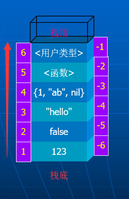
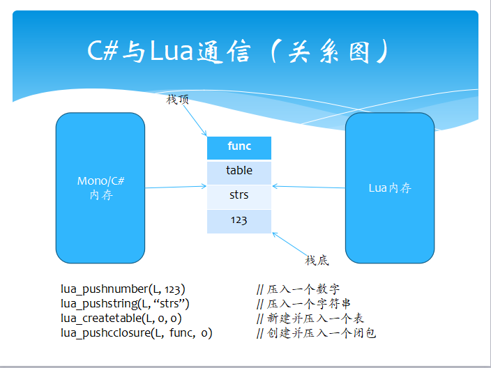
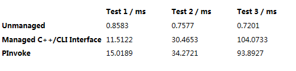

在聊ulua、tolua之前，我们先来看看Unity热更新相关知识。

## 什么是热更新

举例来说： 游戏上线后，玩家下载第一个版本（70M左右或者更大） ，在运营的过程中，如果需要更换UI显示，或者修改游戏的逻辑，这个时候，如果不使用热更新，就需要重新打包，然后让玩家重新下载（浪费流量和时间，体验不好）。 热更新可以在不重新下载客户端的情况下，更新游戏的内容。 热更新一般应用在手机网游上。

## 为什么要用lua做热更新

其实C#本身的反射机制可以实现热更新，但是在ios平台上：

```vbnet
System.Reflection.Assembly.Load
System.Reflection.Emit
System.CodeDom.Compiler
```

无法使用，而动态载入dll或者cs的方法就这几个，因此在ios下不能动态载入dll或者cs文件（已经编译进去的没事），就把传统dotnet动态路径封死了。

所以，只能通过把lua脚本打进ab包，玩家通过解压ab包来更新游戏逻辑和游戏界面。

## lua热更技术

- ulua & tolua
- xlua
- slua
- …

## lua热更新流程

### 原理

使用assetbundle进行资源的更新，而由于lua运行时才编译的特性，所以lua文件也可以被看成是一种资源文件（与fbx、Image等一样）可以打进ab包中。

### 流程

1. 对比files清单文件
2. 更新文件
3. 解压AB包中的资源
4. 初始化

游戏运行时从服务器下载files.txt清单文件,与本地的files.txt清单文件进行对比。如果新下载的files里面的md5值与本地files的md5值不一样,或者本地清单里根本没有这个文件就从服务器下载这个ab包到PersistentDataPath文件夹(可读写)中。下载完毕后解开AB包中的资源,然后完成初始化。

# ulua&tolua原理解析

既然使用了lua作为热更脚本，那肯定避免不了lua和C#之间的交互。

## C#调用lua

C#调用lua的原理是lua的虚拟机，具体步骤可参见[我的博客](http://richbabe.top/2018/07/07/tolua框架Example样例学习笔记-1/)

也可以看看简单的示例：

```csharp
private string script = @"
            function luaFunc(message)
                print(message)
                return 42
            end
        ";
void Start () {
        LuaState l = new LuaState();
        l.DoString(script);
        LuaFunction f = l.GetFunction("luaFunc");
        object[] r = f.Call("I called a lua function!");
        print(r[0]);
}
```

## lua调用C#

### 反射

旧版本的ulua中lua调用C#是基于C#的反射。

C#中的反射使用Assembly定义和加载程序集，加载在程序集清单中列出模块，以及从此程序集中查找类型并创建该类型的实例。

反射用到的命名空间：

```python
System.Reflection
System.Type
System.Reflection.Assembly
```

反射用到的主要类：

- System.Type 类－通过这个类可以访问任何给定数据类型的信息。
- System.Reflection.Assembly类－它可以用于访问给定程序集的信息，或者把这个程序集加载到程序中。

ulua反射调用C#示例：

```csharp
 private string script = @"
            luanet.load_assembly('UnityEngine') 
            luanet.load_assembly('Assembly-CSharp')
           GameObject = luanet.import_type('UnityEngine.GameObject')        
           ParticleSystem = luanet.import_type('UnityEngine.ParticleSystem')         
   
            local newGameObj = GameObject('NewObj')
            newGameObj:AddComponent(luanet.ctype(ParticleSystem))
        ";

//反射调用
void Start () {
        	LuaState lua = new LuaState();
        	lua.DoString(script);
        }
```

可看到通过反射（System.Reflection.Assembly）把UnityEngine程序集加入到lua代码中，通过反射（System.Type）把Unity.GameObject和Unity.ParticleSystem类型加入到lua代码中，这样我们便可以在lua中像在C#里一样调用Unity定义的类。

### 去反射

现版本的ulua（tolua）中lua调用C#是基于去反射。

去反射的意思是：

把所有的c#类的public成员变量、成员函数，都导出到一个相对应的Wrap类中，而这些成员函数通过特殊的标记，映射到lua的虚拟机中，当在lua中调用相对应的函数时候，直接调用映射进去的c# wrap函数，然后再调用到实际的c#类，完成调用过程。

具体调用过程可参考： [Unity3d ulua c#与lua交互+wrap文件理解](https://blog.csdn.net/pengdongwei/article/details/50420612)

因为反射在效率上存在不足，所以通过wrap来提升性能。但是因为wrap需要自己去wrap，所以在大版本更新是可以用到的，小版本更新还是使用反射。

## C#与Lua数据交互（lua虚拟栈）

C#与lua的数据交互是基于一个Lua先进后出的虚拟栈：

（1）若Lua虚拟机堆栈里有N个元素，则可以用 1 ~ N 从栈底向上索引，也可以用 -1 ~ -N 从栈顶向下索引，一般后者更加常用。

（2）堆栈的每个元素可以为任意复杂的Lua数据类型（包括table、function等），堆栈中没有元素的空位，隐含为包含一个“空”类型数据

（3）TValue stack[max_stack_len] // 定义在 lstate.c 的stack_init函数

关于Lua虚拟栈入栈的具体操作做可以见下图：

更详细的可见： [Lua初学者（四）–Lua调用原理展示（lua的堆栈）](https://blog.csdn.net/zhuzhuyule/article/details/41086745)

## C#与Lua通信（P/Invoke）

- 所有的通信都是基于P/Invoke模式（性能低）类似JNI
- P/Invoke：公共语言运行库（CLR）的interop功能（称为平台调用（P/Invoke））
- 命名空间：System.Runtime.InteropServices

示例：

```csharp
[DllImport(LUADLL, CallingConvention = CallingConvention.Cdecl)]
public static extern IntPtr luaL_newstate();
```

P/Invoke 要求方法被声明为 static。

P/Invoke性能：

### 为啥P/Invoke看起来这么慢？

（1）寻址方式：调用时指定了CharSet=CharSet.Ansi 那么CLR首先在非托管的DLL中寻找，若找不到，就用带A后缀的函数进行搜索造成开销，可将ExactSpelling的值设为true防止CLR通过修改入口名称进行搜索。

（2）类型转换：在Managed Code和Native Code间传递参数和返回值的过程成为marshalling。托管函数每次调用非托管函数时，都要求执行以下几项操作：

- 将函数调用参数从CLR封送到本机类型。
- 执行托管到非托管形式转换。
- 调用非托管函数（使用参数的本机版本）
- Interop在进行封送时候，对bittable可以不进行拷贝，而是直接内存锚定。
- 将返回类型及任何“out”或“in,out”参数从本机类型封送到 CLR 类型。

（3）VC++ 提供自己的互操作性支持，这称为 C++ Interop。 C++ Interop 优于 P/Invoke，因为 P/Invoke 不具有类型安全性，参数传递还需要做类型检查。

Bittable类型（byte,int,uint）与非Bittable类型（char, boolean,array,class）

参考书： NET互操作 P_Invoke，C++Interop和COM Interop.pdf

# ulua的优化方式汇总

- BinderLua太多wrap很慢（反射与去反射共存）
- Lua代码打入AssetBundle为了绕过苹果检测
- 动态注册Wrap文件到Lua虚拟机（tolua延伸）
- ToLuaExport. memberFilter的函数过滤
- 尽量减少c#调用lua的次数来做主题优化思想
- 尽量使用lua中的容器table取代c#中的所有容器
- 例子CallLuaFunction_02里附带了no gc alloc调用方式
- Lua的bytecode模式性能要低于Lua源码执行
- 取消动态参数：打开LuaFunction.cs文件，找到函数声明：

```csharp
public object[] Call(params object[] args){
    return call(args, null);
}
```

取消动态参数args，可用较笨方法，就是定义6-7个默认参数，不够再加。

- 安卓平台如果使用luajit的话，记得在lua最开始执行的地方请开启 jit.off()，性能会提升N倍。
- 记得安卓平台上在加上jit.opt.start(3)，相当于c++程序-O3，可选范围0-3，性能还会提升。Luajit作者建议-O2