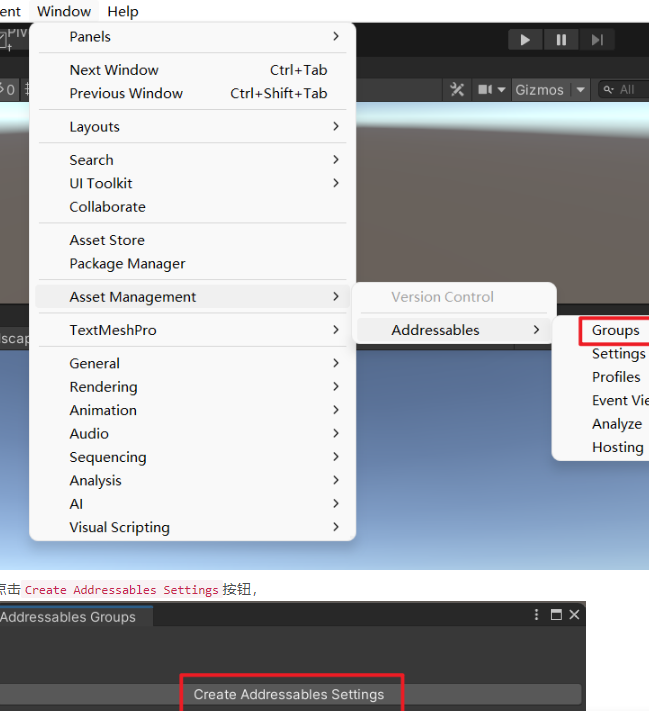
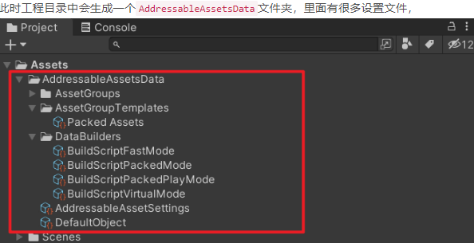
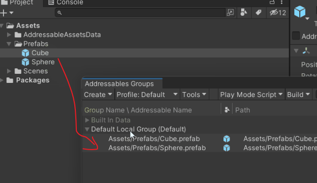
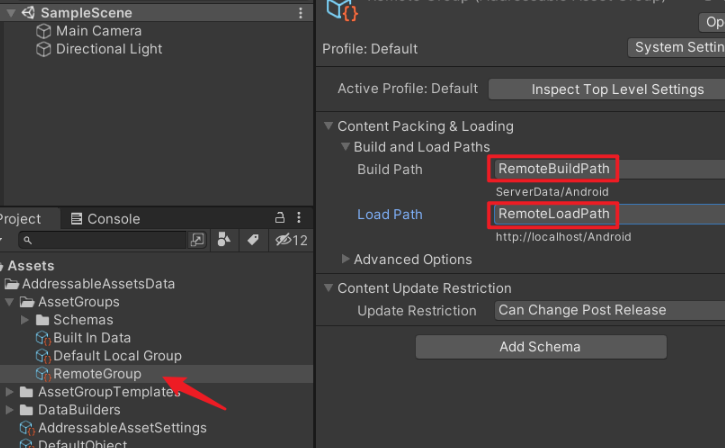
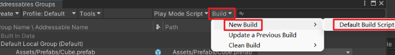

`Addressables`的打包方式其实也是`AssetBundle`格式，只是在此基础上做了一层封装，方便进行管理（比如打包、加载、依赖等）。而我们知道，没有加密的`AssetBundle`是可以使用`AssetStudio`等工具轻易进行资源逆向的


### 基础操作


- 插件包管理界面下载安装

- Group菜单

  

- 创建设置

  


- 本地默认组：Default Local Group （Default）
  - Addressables 默认是按Group为颗粒进行AssetBundle打包的，比如我把资源A、B、C都放在这个Default Local Group组里，那么它们会被打在同一个AssetBundle中（也可以修改成按单独的资源文件为颗粒进行打包）


- 拖拽资源

  

- 创建Group

  - 上面的默认`Group`一般是作为`包内资源`，现在我们创建一个新的`Group`作为`包外资源`的组（通过远程加载资源）。
    如下，在`Addressables Groups`窗口中，点击左上角的`Create`按钮，点击`Group / Packed Assets`菜单，

- 设置Path

  


- 打Addressable资源包

  


### 资源加载

##### 方式一：通过Addressable Name来加载资源

加载资源的时候，并不需要知道目标资源到底是在哪个Group中，也不需要知道这个Group到底是本地资源包还是远程资源包，统一通过资源的Addressable Name来加载，资源的Addressable Name在哪里看呢？
比如Cube预设，在Inspector窗口中，可以看到它的Addressable Name为Assets/Prefabs/Cube.prefab，这个Addressable Name默认是资源被加入Group时的相对路径

可以修改`Addressable Name`，比如我改成`HelloCube`也是可以的，它仅仅是作为一个索引的字符串，当我们把`Cube`预设移动到其他的目录中，这个`Addressable`地址并不会变


```
using UnityEngine;
using UnityEngine.AddressableAssets;

public class Main : MonoBehaviour
{
    void Start()
    {
        Addressables.LoadAssetAsync<GameObject>("Assets/Prefabs/Cube.prefab").Completed += (handle) =>
        {
            // 预设物体
            GameObject prefabObj = handle.Result;
            // 实例化
            GameObject cubeObj = Instantiate(prefabObj);
        };
        
        //Addressables.InstantiateAsync
    }
}


```


##### 方式二：通过AssetReference来加载资源