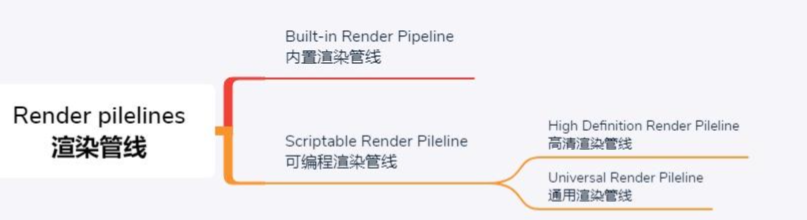
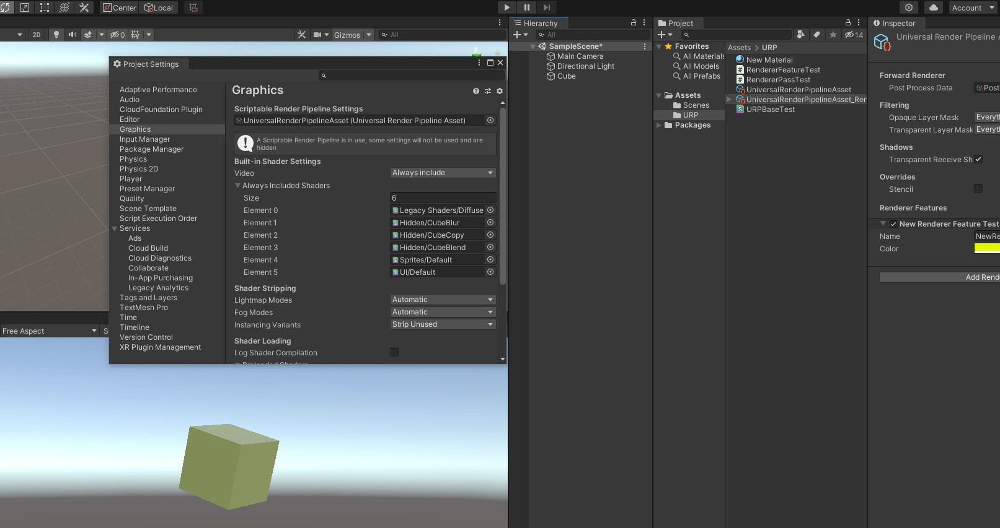

## 渲染管线


- SRP
  - URP
  - HDRP




## 引入SRP

**内置渲染管线的缺陷**

- **定制性差**：过去，Unity有一套内置渲染管线，渲染管线全部写在引擎的源码里。大家基本上不能改动，除非是买了Unity源码客户，当然大部分开发者是不会去改源码，所以过去的管线对开发者来说，很难进行定制。
- **代码脓肿，效果效率无法做到最佳：**内置渲染管线在一个渲染管线里面支持所有的二十多个平台，包括非常高端的PC平台，也包括非常低端的平台，很老的手机也要支持，所以代码越来越浓肿，很难做到使效率和效果做到最佳。

**目的：**

- 为了解决仅有一个默认渲染管线，造成的可配置型、可发现性、灵活性等问题。决定在C++端保留一个非常小的渲染内核，让C#端可以通过API暴露出更多的选择性，也就是说，Unity会提供一系列的C# API以及内置渲染管线的C#实现；这样一来，一方面可以保证C++端的代码都能严格通过各种白盒测试，另一方面C#端代码就可以在实际项目中调整。


## URP Demo





- RendererPassTest.cs

```csharp
using System.Collections;
using System.Collections.Generic;
using UnityEngine;
using UnityEngine.Rendering;
using UnityEngine.Rendering.Universal;
 
public class RendererPassTest : ScriptableRenderPass
{
    Color m_Color;
 
    Material m_Mat = new Material(Shader.Find("Hidden/URPBaseTest"));
 
    //RT的Filter
    public FilterMode filterMode { get; set; }
 
    //当前阶段渲染的颜色RT
    RenderTargetIdentifier m_Source;
 
    //辅助RT
    RenderTargetHandle m_TemporaryColorTexture;
 
    //Profiling上显示
    ProfilingSampler m_ProfilingSampler = new ProfilingSampler("URPTest");
 
    public RendererPassTest()
    {
        //在哪个阶段插入渲染
        renderPassEvent = RenderPassEvent.AfterRenderingOpaques;
 
        //初始化辅助RT名字
        m_TemporaryColorTexture.Init("URPBaseTest");
    }
 
    public void Setup(RenderTargetIdentifier source, Color color)
    {
        m_Source = source;
        m_Color = color;
        m_Mat.SetColor("_Color", m_Color);
    }
    
    public override void Execute(ScriptableRenderContext context, ref RenderingData renderingData)
    {
        CommandBuffer cmd = CommandBufferPool.Get();
        //using的做法就是可以在FrameDebug上看到里面的所有渲染
        using (new ProfilingScope(cmd, m_ProfilingSampler))
        {
            //创建一张RT
            RenderTextureDescriptor opaqueDesc = renderingData.cameraData.cameraTargetDescriptor;
            opaqueDesc.depthBufferBits = 0;
            cmd.GetTemporaryRT(m_TemporaryColorTexture.id, opaqueDesc, filterMode);
 
            //将当前帧的颜色RT用自己的着色器渲处理然后输出到创建的贴图上
            Blit(cmd, m_Source, m_TemporaryColorTexture.Identifier(), m_Mat);
 
            //将处理后的RT重新渲染到当前帧的颜色RT上
            Blit(cmd, m_TemporaryColorTexture.Identifier(), m_Source);
        }
        //执行
        context.ExecuteCommandBuffer(cmd);
 
        //回收
        CommandBufferPool.Release(cmd);
    }
    public override void FrameCleanup(CommandBuffer cmd)
    {
        base.FrameCleanup(cmd);
        //销毁创建的RT
        cmd.ReleaseTemporaryRT(m_TemporaryColorTexture.id);
    }
}
```

- RendererFeatureTest.cs

```c#
using System.Collections;
using System.Collections.Generic;
using UnityEngine;
using UnityEngine.Rendering.Universal;
 
public class RendererFeatureTest : ScriptableRendererFeature
{
    //会显示在资产面板上
    public Color m_Color = Color.red;
 
    RendererPassTest m_Pass;
 
    //feature被创建时调用
    public override void Create()
    {
        m_Pass = new RendererPassTest();
    }
   
    //每一帧都会被调用
    public override void AddRenderPasses(UnityEngine.Rendering.Universal.ScriptableRenderer renderer, ref RenderingData renderingData)
    {
        //将当前渲染的颜色RT传到Pass中
        m_Pass.Setup(renderer.cameraColorTarget, m_Color);
        //将这个pass添加到渲染队列
        renderer.EnqueuePass(m_Pass);
    }
 
    //一帧渲染完最后调用
    protected override void Dispose(bool disposing)
    {
        base.Dispose(disposing);
    }
}
```


- URPBaseTest.shader

```
Shader "Hidden/URPBaseTest"
{
	Properties
	{
		_MainTex("ScreenTexture", 2D) = "white" {}
		_Color("Color", Color) = (1,1,1,1)
	}
	SubShader
	{
		Tags { "RenderType" = "Opaque" }
		LOD 100
 
		Pass
		{
			 HLSLPROGRAM
			#include "Packages/com.unity.render-pipelines.universal/ShaderLibrary/Core.hlsl"
 
			#pragma vertex vert
			#pragma fragment frag
 
			struct Attributes
			{
				float4 positionOS : POSITION;
				float2 uv:TEXCOORD0;
			};
 
			struct Varyings
			{
				float4 positionCS : SV_POSITION;
				float2 uv:TEXCOORD0;
			};
 
			float4 _Color;
			sampler2D _MainTex;
			float4 _MainTex_ST;
 
			Varyings vert(Attributes v)
			{
				Varyings o = (Varyings)0;
 
				VertexPositionInputs vertexInput = GetVertexPositionInputs(v.positionOS.xyz);
				o.positionCS = vertexInput.positionCS;
				o.uv = TRANSFORM_TEX(v.uv, _MainTex);
				return o;
			}
 
			half4 frag(Varyings i) : SV_Target
			{
				half4 col = tex2D(_MainTex, i.uv);
				return lerp(col, _Color, 0.2);
			}
			ENDHLSL
		}
	}
}
```


[参考](https://blog.csdn.net/qq_33700123/article/details/114092028)
