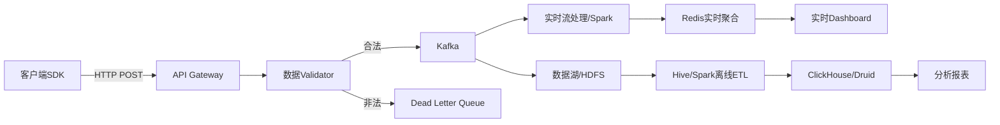

# 游戏数据埋点与分析系统工程化实践

## 一、引言：为什么游戏需要数据工程

在今天的游戏行业中，「数据驱动」已经从口号变成了生存必需品。从设计阶段的用户研究，到上线后的留存优化、付费转化，再到运营活动的ROI评估——每一个决策背后都需要可靠的数据支撑。

但很多游戏团队在数据建设上存在两个极端：要么随意打点，数据质量堪忧；要么过度追求完美，导致数据管道成为项目瓶颈。

本文的目标是提供一个**可落地的游戏数据工程化方案**，从埋点设计到分析展示，覆盖全链路。

### 数据管道的价值层次

```
┌─────────────────────────────────────┐
│        Layer 5: 数据驱动决策         │  ← 自动调优、动态难度、个性化推荐
├─────────────────────────────────────┤
│     Layer 4: 实时运营与A/B测试      │  ← 实时大盘、实验框架、预警系统
├─────────────────────────────────────┤
│        Layer 3: 分析平台            │  ← 留存、漏斗、LTV、用户分群
├─────────────────────────────────────┤
│        Layer 2: 数据仓库            │  ← ETL、数据清洗、维度建模
├─────────────────────────────────────┤
│        Layer 1: 埋点采集            │  ← 客户端SDK、事件规范、校验
└─────────────────────────────────────┘
```

---

## 二、埋点系统架构设计

### 2.1 统一事件模型

一个好的埋点系统，首先需要一套严格的事件定义规范：

```csharp
[System.Serializable]
public struct GameEvent
{
    public string eventName;           // 事件名 e.g. "battle_start"
    public string eventVersion;        // 事件版本号
    public long timestamp;             // UTC毫秒时间戳
    public string userId;              // 用户唯一标识
    public string sessionId;           // 会话ID
    
    // 设备信息（自动采集）
    public DeviceInfo device;
    
    // 游戏上下文
    public GameContext context;
    
    // 自定义参数（灵活扩展）
    public Dictionary<string, object> properties;
}

[System.Serializable]
public struct DeviceInfo
{
    public string platform;      // "iOS" / "Android" / "PC"
    public string osVersion;
    public string deviceModel;
    public string cpuInfo;
    public string gpuInfo;
    public int memoryMB;
    public string networkType;   // "wifi" / "4g" / "5g"
}

[System.Serializable]
public struct GameContext
{
    public int levelId;          // 当前关卡
    public string sceneName;     // 当前场景
    public float gameTime;       // 游戏内时间(秒)
    public int playerLevel;      // 玩家等级
    public int vipLevel;         // VIP等级
    public string serverId;      // 服务器ID
    public int fps;              // 当前帧率
    public long memoryUsage;     // 内存占用
}
```

### 2.2 事件分类与命名规范

```
事件命名：{领域}_{动作}_{状态}
e.g. 
  - battle_start       ：战斗开始
  - battle_end         ：战斗结束
  - item_use           ：使用道具
  - shop_purchase      ：商店购买
  - level_complete     ：关卡完成
  - level_fail         ：关卡失败
  - social_friend_add  ：添加好友
  - ui_page_view       ：页面浏览
```

**事件分类矩阵**：

| 分类 | 描述 | 示例 | 优先级 |
|------|------|------|--------|
| Core | 核心玩法行为 | battle_start/end | P0 |
| Economy | 经济相关 | shop_purchase, item_get | P0 |
| Progression | 进度追踪 | level_complete, quest_accept | P1 |
| Social | 社交行为 | chat_send, guild_join | P1 |
| UI | 界面交互 | ui_button_click | P2 |
| Performance | 性能监控 | performance_frame_drop | P0 |
| Error | 错误上报 | error_crash, error_api | P0 |
| Debug | 开发调试 | debug_state_dump | P3 |

### 2.3 客户端SDK设计

```csharp
public class TelemetrySDK : Singleton<TelemetrySDK>
{
    // 批量发送缓冲区
    private readonly Queue<GameEvent> _eventBuffer = new();
    private const int FLUSH_THRESHOLD = 50;  // 50条一批
    private const float FLUSH_INTERVAL = 5f; // 或5秒一次
    
    private float _flushTimer;
    private bool _isInitialized;
    
    // 采样率配置（性能相关事件低采样）
    private Dictionary<string, float> _samplingRates = new()
    {
        ["performance_frame_drop"] = 0.01f,   // 1%采样
        ["ui_button_click"] = 1.0f,           // 全量
        ["battle_end"] = 1.0f,                // 全量
    };
    
    public void TrackEvent(string eventName, Dictionary<string, object> properties = null)
    {
        if (!ShouldSample(eventName)) return;
        
        var evt = new GameEvent
        {
            eventName = eventName,
            timestamp = DateTimeOffset.UtcNow.ToUnixTimeMilliseconds(),
            userId = GetUserId(),
            sessionId = _sessionId,
            device = CollectDeviceInfo(),
            context = CollectGameContext(),
            properties = properties ?? new Dictionary<string, object>()
        };
        
        EnqueueEvent(evt);
    }
    
    private void EnqueueEvent(GameEvent evt)
    {
        lock (_eventBuffer)
        {
            _eventBuffer.Enqueue(evt);
            if (_eventBuffer.Count >= FLUSH_THRESHOLD)
            {
                FlushToServer();
            }
        }
    }
    
    private IEnumerator FlushRoutine()
    {
        while (true)
        {
            yield return new WaitForSecondsRealtime(FLUSH_INTERVAL);
            FlushToServer();
        }
    }
    
    private void FlushToServer()
    {
        GameEvent[] batch;
        lock (_eventBuffer)
        {
            if (_eventBuffer.Count == 0) return;
            batch = _eventBuffer.ToArray();
            _eventBuffer.Clear();
        }
        
        // 压缩后异步发送
        var json = JsonUtility.ToJson(new EventBatch { events = batch });
        var compressed = Compress(json);
        StartCoroutine(SendRequest(compressed));
    }
    
    private bool ShouldSample(string eventName)
    {
        if (!_samplingRates.TryGetValue(eventName, out float rate))
            return true;  // 未配置采样率的事件全量采集
        return Random.value < rate;
    }
}
```

---

## 三、埋点最佳实践

### 3.1 用户旅程追踪

```csharp
public class UserJourneyTracker
{
    // 追踪用户在关键节点的转化
    public void TrackOnboardingCompletion()
    {
        TelemetrySDK.Instance.TrackEvent("onboarding_step_complete", new()
        {
            ["step_name"] = "tutorial_battle",
            ["step_number"] = 3,
            ["total_steps"] = 5,
            ["time_spent_sec"] = _timer.Elapsed.TotalSeconds
        });
    }
}
```

### 3.2 经济系统追踪

```csharp
public class EconomyTracker
{
    public void TrackCurrencyChange(
        string currencyType,   // "gold" / "diamond" / "stamina"
        long changeAmount,     // 变化量（正/负）
        long finalBalance,     // 最终余额
        string reason,         // "purchase" / "reward" / "consumption"
        string detail)         // 详细原因
    {
        TelemetrySDK.Instance.TrackEvent("economy_currency_change", new()
        {
            ["currency_type"] = currencyType,
            ["change_amount"] = changeAmount,
            ["final_balance"] = finalBalance,
            ["reason"] = reason,
            ["detail"] = detail
        });
    }
    
    public void TrackPurchase(string itemId, string itemType, 
        string currencyType, long cost, string storeName)
    {
        TelemetrySDK.Instance.TrackEvent("shop_purchase", new()
        {
            ["item_id"] = itemId,
            ["item_type"] = itemType,
            ["currency_type"] = currencyType,
            ["cost"] = cost,
            ["store_name"] = storeName
        });
    }
}
```

### 3.3 性能监控埋点

```csharp
public class PerformanceMonitor : MonoBehaviour
{
    private float _frameTimeHistory;
    private int _frameCount;
    private const int SAMPLE_INTERVAL = 60; // 每60帧采样一次
    
    private void Update()
    {
        _frameTimeHistory += Time.deltaTime;
        _frameCount++;
        
        if (_frameCount >= SAMPLE_INTERVAL)
        {
            float avgFrameTime = _frameTimeHistory / SAMPLE_INTERVAL;
            float fps = 1f / avgFrameTime;
            
            if (fps < 30f)
            {
                TelemetrySDK.Instance.TrackEvent("performance_frame_drop", new()
                {
                    ["avg_fps"] = fps,
                    ["min_fps"] = GetMinFpsInWindow(),
                    ["scene_name"] = SceneManager.GetActiveScene().name,
                    ["device_memory_mb"] = SystemInfo.systemMemorySize
                });
            }
            
            _frameTimeHistory = 0f;
            _frameCount = 0;
        }
    }
}
```

---

## 四、数据管道与后端处理

### 4.1 服务端接收与校验

```csharp
[ApiController]
[Route("api/v1/telemetry")]
public class TelemetryController : ControllerBase
{
    private readonly ITelemetryValidator _validator;
    private readonly IEventBuffer _buffer;
    
    [HttpPost("events")]
    public async Task<IActionResult> SubmitEvents([FromBody] EventBatch batch)
    {
        // 1. 基础校验
        if (batch.events == null || batch.events.Length == 0)
            return BadRequest("Empty event batch");
            
        if (batch.events.Length > 500)
            return BadRequest("Batch too large");
        
        // 2. 数据验证与清洗
        var validEvents = new List<GameEvent>();
        foreach (var evt in batch.events)
        {
            if (_validator.Validate(evt, out string error))
            {
                validEvents.Add(EnrichEvent(evt));
            }
            else
            {
                Log.Warning($"Invalid event: {evt.eventName}, error: {error}");
            }
        }
        
        // 3. 写入缓冲队列（Kafka / Pulsar）
        await _buffer.ProduceAsync(validEvents);
        
        return Ok(new { accepted = validEvents.Count, rejected = batch.events.Length - validEvents.Count });
    }
    
    private GameEvent EnrichEvent(GameEvent evt)
    {
        // 服务端补充信息
        evt.properties["server_time"] = DateTimeOffset.UtcNow.ToUnixTimeMilliseconds();
        evt.properties["ip_country"] = GetClientIPCountry();
        return evt;
    }
}
```

### 4.2 数据验证规则

```csharp
public class TelemetryValidator : ITelemetryValidator
{
    private readonly HashSet<string> _allowedEvents = new()
    {
        "battle_start", "battle_end", "shop_purchase", 
        "level_complete", "level_fail", "item_use"
    };
    
    public bool Validate(GameEvent evt, out string error)
    {
        // 事件名白名单
        if (!_allowedEvents.Contains(evt.eventName))
        {
            error = $"Unknown event: {evt.eventName}";
            return false;
        }
        
        // 时间戳合理性（允许前后5分钟误差）
        long now = DateTimeOffset.UtcNow.ToUnixTimeMilliseconds();
        if (Math.Abs(evt.timestamp - now) > TimeSpan.FromMinutes(5).TotalMilliseconds)
        {
            error = $"Timestamp out of range: {evt.timestamp}";
            return false;
        }
        
        // 必填字段
        if (string.IsNullOrEmpty(evt.userId))
        {
            error = "Missing userId";
            return false;
        }
        
        error = null;
        return true;
    }
}
```

---

## 五、分析计算与指标体系

### 5.1 核心指标计算

```csharp
public class GameAnalyticsCalculator
{
    // 日活跃用户 (DAU)
    public int CalculateDAU(List<LoginEvent> todayLogins)
    {
        return todayLogins.Select(e => e.userId).Distinct().Count();
    }
    
    // 次日留存率
    public double CalculateD1Retention(List<LoginEvent> allLogins, DateTime installDate)
    {
        var newUsers = allLogins
            .Where(e => e.firstLoginDate.Date == installDate.Date)
            .Select(e => e.userId)
            .Distinct()
            .ToList();
            
        if (newUsers.Count == 0) return 0;
        
        var retainedNextDay = allLogins
            .Where(e => e.loginDate.Date == installDate.AddDays(1).Date)
            .Select(e => e.userId)
            .Intersect(newUsers)
            .Count();
            
        return (double)retainedNextDay / newUsers.Count;
    }
    
    // 每付费用户平均收入 (ARPPU)
    public double CalculateARPPU(List<PurchaseEvent> purchases, DateTime date)
    {
        var payingUsers = purchases
            .Where(p => p.purchaseDate.Date == date.Date)
            .Select(p => p.userId)
            .Distinct()
            .Count();
            
        var totalRevenue = purchases
            .Where(p => p.purchaseDate.Date == date.Date)
            .Sum(p => p.amount);
            
        return payingUsers > 0 ? totalRevenue / payingUsers : 0;
    }
}
```

### 5.2 用户分群（Cohort Analysis）

```csharp
public enum UserCohort
{
    All,               // 全量用户
    NewUser,           // 新增用户（注册<7天）
    ReturningUser,     // 回流用户（>=7天未登录后回归）
    Whale,             // 大R（累计付费>5000）
    MediumPayer,       // 中R（累计付费500-5000）
    FreeUser,          // 免费用户
    ChurnedUser,       // 流失用户（15天未登录）
    AtRiskUser,        // 预警用户（5-14天未登录）
}

public class UserSegmentationService
{
    private readonly Dictionary<string, UserProfile> _userProfiles;
    
    public UserCohort ClassifyUser(string userId)
    {
        if (!_userProfiles.TryGetValue(userId, out var profile))
            return UserCohort.All;
            
        int daysSinceLastLogin = (DateTime.UtcNow - profile.lastLoginTime).Days;
        int accountAgeDays = (DateTime.UtcNow - profile.registerTime).Days;
        
        if (daysSinceLastLogin >= 15)
            return UserCohort.ChurnedUser;
        if (daysSinceLastLogin >= 5)
            return UserCohort.AtRiskUser;
        if (accountAgeDays <= 7)
            return UserCohort.NewUser;
        if (daysSinceLastLogin > 3 && accountAgeDays > 30)
            return UserCohort.ReturningUser;
        if (profile.totalRevenue >= 5000)
            return UserCohort.Whale;
        if (profile.totalRevenue > 0)
            return UserCohort.MediumPayer;
            
        return UserCohort.FreeUser;
    }
}
```

### 5.3 漏斗分析

```csharp
public class FunnelAnalysis
{
    private readonly string[] _funnelSteps = 
    {
        "app_launch",
        "onboarding_start", 
        "onboarding_complete",
        "first_battle_start",
        "first_battle_complete",
        "first_shop_visit",
        "first_purchase"
    };
    
    public FunnelReport CalculateFunnel(DateTime start, DateTime end)
    {
        var report = new FunnelReport();
        int previousCount = -1;
        
        foreach (var step in _funnelSteps)
        {
            int count = GetEventCount(step, start, end);
            report.Steps.Add(new FunnelStep
            {
                eventName = step,
                userCount = count,
                conversionRate = previousCount > 0
                    ? (double)count / previousCount
                    : 1.0
            });
            previousCount = count;
        }
        
        // 整体转化率
        if (report.Steps.Count > 0)
        {
            int firstStep = report.Steps[0].userCount;
            int lastStep = report.Steps[^1].userCount;
            report.overallConversionRate = firstStep > 0
                ? (double)lastStep / firstStep
                : 0;
        }
        
        return report;
    }
}
```

---

## 六、A/B测试框架

### 6.1 实验配置与管理

```csharp
[System.Serializable]
public class ExperimentConfig
{
    public string experimentId;
    public string name;
    public DateTime startDate;
    public DateTime endDate;
    public List<ExperimentVariant> variants;
    public string targetingRule;     // 表达式："user.level > 5 && user.dau > 3"
    public string primaryMetric;     // 核心指标："day7_retention"
    public double significanceLevel = 0.05;
}

[System.Serializable]
public struct ExperimentVariant
{
    public string variantId;    // "control" / "treatment_a" / "treatment_b"
    public double traffic;      // 流量占比
    public Dictionary<string, object> parameters;
}
```

### 6.2 客户端实验SDK

```csharp
public class ExperimentService
{
    private Dictionary<string, string> _activeExperiments;  // experimentId → variantId
    
    public async UniTask FetchExperiments(string userId)
    {
        var configs = await RequestExperimentsFromServer();
        
        foreach (var config in configs)
        {
            if (!IsUserTargeted(userId, config)) continue;
            
            // 基于用户ID的稳定分桶
            string variantId = AssignVariant(userId, config);
            _activeExperiments[config.experimentId] = variantId;
        }
    }
    
    private string AssignVariant(string userId, ExperimentConfig config)
    {
        // 使用hashing保证同一用户始终进入同一组
        uint hash = (uint)Mathf.Abs(userId.GetHashCode());
        double normalized = (double)hash / uint.MaxValue;
        
        double cumulative = 0;
        foreach (var variant in config.variants)
        {
            cumulative += variant.traffic;
            if (normalized <= cumulative)
                return variant.variantId;
        }
        
        return config.variants[^1].variantId;
    }
    
    // 游戏层查询实验参数
    public int GetIntParam(string experimentId, string paramName, int defaultValue)
    {
        if (!_activeExperiments.TryGetValue(experimentId, out string variantId))
            return defaultValue;
            
        // 从配置获取
        return GetParamFromConfig(experimentId, variantId, paramName, defaultValue);
    }
}
```

### 6.3 统计显著性检验

```csharp
public class ABTestAnalyzer
{
    public struct ABTestResult
    {
        public bool isSignificant;
        public double pValue;
        public double liftPercent;         // 提升百分比
        public double confidenceInterval;  // 置信区间
        public string winnerVariant;
    }
    
    public ABTestResult Analyze(string experimentId, 
        Dictionary<string, MetricSample> controlSamples,
        Dictionary<string, MetricSample> treatmentSamples)
    {
        // 使用Z检验判断转化率差异
        double pControl = (double)controlSamples["success"] / controlSamples["total"];
        double pTreatment = (double)treatmentSamples["success"] / treatmentSamples["total"];
        
        double pooledSE = Math.Sqrt(
            pControl * (1 - pControl) / controlSamples["total"] +
            pTreatment * (1 - pTreatment) / treatmentSamples["total"]
        );
        
        double zScore = (pTreatment - pControl) / pooledSE;
        double pValue = 2 * (1 - NormalCDF(Math.Abs(zScore)));
        
        return new ABTestResult
        {
            isSignificant = pValue < 0.05,
            pValue = pValue,
            liftPercent = (pTreatment - pControl) / pControl * 100,
            confidenceInterval = 1.96 * pooledSE,
            winnerVariant = pTreatment > pControl ? "treatment" : "control"
        };
    }
    
    private double NormalCDF(double x)
    {
        // Abramowitz and Stegun approximation
        double t = 1.0 / (1.0 + 0.2316419 * Math.Abs(x));
        double d = 0.3989423 * Math.Exp(-x * x / 2);
        double p = d * (t * (0.3193815 + t * (-0.3565638 + t * (1.781478 + 
            t * (-1.821256 + t * 1.330274)))));
        return x > 0 ? 1 - p : p;
    }
}
```

---

## 七、数据质量保障体系

### 7.1 埋点覆盖率检测

```csharp
public class CoverageChecker
{
    // 自动化检测未打点的代码路径
    private readonly List<string> _definedEvents = GetAllDefinedEvents();
    
    public CoverageReport CheckCoverage()
    {
        var report = new CoverageReport();
        
        // 检查代码中是否所有事件都被正确调用
        foreach (var evt in _definedEvents)
        {
            var references = FindReferences(evt);
            if (references.Count == 0)
            {
                report.MissingImplementations.Add(evt);
            }
        }
        
        return report;
    }
}
```

### 7.2 数据一致性校验



---

## 八、最佳实践总结

### 8.1 埋点设计原则

1. **明确目的**：每个事件必须有明确的业务分析目标
2. **标准命名**：事件名统一格式`{领域}_{动作}_{状态}`
3. **最小化采集**：只采集必要字段，避免数据膨胀
4. **版本控制**：事件schema带上版本号，支持向后兼容
5. **采样可控**：高频事件支持按比例采样
6. **客户端缓存**：网络异常时不丢事件，本地缓存恢复

### 8.2 数据质量红线

| 指标 | 红线 | 说明 |
|------|------|------|
| 埋点覆盖率 | ≥95% | 已定义事件必须有实现 |
| 事件延迟<br>P99 | ≤60s | 从产生到入库 |
| 数据准确率 | ≥99.9% | 服务端验证通过率 |
| 重复事件率 | ≤1% | 去重后统计 |
| 客户端丢事件率 | ≤0.1% | 用户触发生成但未上报 |

### 8.3 避坑指南

- ❌ **不要在Update中埋点**：高频事件会导致性能灾难
- ✅ **将UI交互事件绑定到按钮回调而非Update检测**
- ❌ **不要用PlayerPrefs存储事件队列**：IO频繁且不可靠
- ✅ **使用内存队列 + 异步文件写入或直接网络发送**
- ❌ **不要遗漏服务端事件的校验**：客户端数据不可信
- ✅ **服务端做业务层的补充校验（用户是否真的拥有该道具等）**
- ❌ **不要等上线后才发现漏埋点**
- ✅ **利用自动化测试检测代码中的埋点一致性**

### 8.4 调试辅助工具

```csharp
#if UNITY_EDITOR || DEVELOPMENT_BUILD
public class EventDebugger : MonoBehaviour
{
    private readonly Queue<string> _recentEvents = new(100);
    private Vector2 _scrollPos;
    
    private void OnEnable()
    {
        TelemetrySDK.Instance.OnEventTracked += OnEventTracked;
    }
    
    private void OnEventTracked(GameEvent evt)
    {
        _recentEvents.Enqueue($"[{evt.eventName}] {JsonUtility.ToJson(evt.properties)}");
    }
    
    private void OnGUI()
    {
        GUILayout.BeginArea(new Rect(10, 10, 400, 600), GUI.skin.box);
        GUILayout.Label("[最近的埋点事件]");
        _scrollPos = GUILayout.BeginScrollView(_scrollPos);
        foreach (var evt in _recentEvents)
        {
            GUILayout.Label(evt);
        }
        GUILayout.EndScrollView();
        GUILayout.EndArea();
    }
}
#endif
```

---

## 九、总结

游戏数据埋点与分析系统不是一个简单的「上报-存储-展示」管道，而是一个需要从架构高度设计的工程系统：

1. **埋点规范**是数据工程的基石，统一的标准比完美的方案更重要
2. **客户端SDK**需要关注性能（批量、压缩、采样）、可靠性（缓存重试）和可调试
3. **服务端管道**负责验证、清洗、富化和路由，是数据质量的守护者
4. **分析体系**需要围绕核心指标（留存、付费、LTV、转化漏斗）构建
5. **A/B测试**是把数据从「描述」变为「决策」的关键工具

最后，记住一个原则：**数据系统建设本身也需要ROI评估**——投入产出比最高的做法是按需求优先级逐步迭代，而非一次性搭建完美的巨系统。