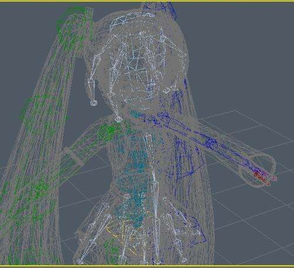
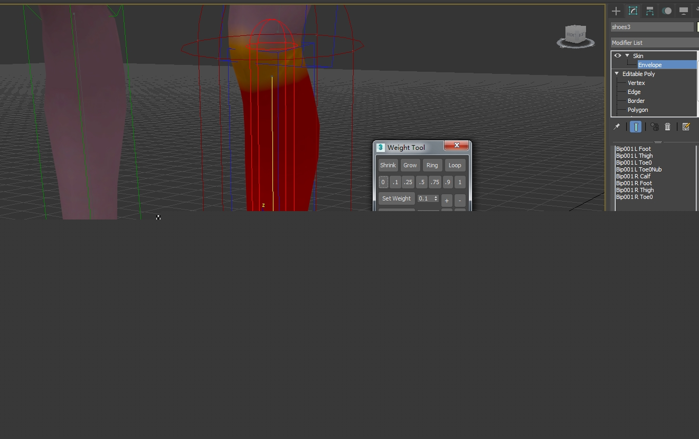

了解下角色换装

**骨骼**

------

　　我们在引擎中使用的任何可绘制的物体,也就是mesh,往往是由顶点信息所组成的集合。渲染的过程,也就是利用这些顶点信息,把这些模型绘制出来。如果对于没有动作的静态模型,这一切就足够了。当我们提到模型动画的时候,无论以何种方式来实现动画,最本质上都是对模型顶点集合的一系列变换。所以在3dmax中要想制作一个动画,并不需要一定有骨骼,你可以在关键帧中直接修改模型的顶点信息。可以想象,这种方式无疑是低效的,特别是对于复杂的模型的复杂动作。这也就引出了"骨骼+蒙皮"的工作方式。在3DMAX中,有两种骨骼,分别是Bones和Bip(如图2).前者的自由度较高,后者则是特殊版的Bones,按照人体的骨骼结构,制定好规范,直接使用。Bones的一般用于场景物件和非脊椎动物的动作,比如披风,旗帜,鸟类,而Bip大多用于脊椎动物,或类人生物的主体部分。本系列中主要以Bip骨骼为例,这是一个典型的父子层次结构。基本符合人体的关节布局和限制。这样基于骨骼来制作动画,既直观又方便。

**蒙皮**

------

　　前面我们提到动画实际上mesh的顶点在进行运动。单纯的骨骼并不会对Mesh顶点的变化有任何影响,而蒙皮的意义就在于把Mesh上的顶点与对应骨骼关联起来。之后只需要对骨骼进行动画关键帧的制作,就可以带动模型的顶点产生变化。那骨骼具体是怎么与mesh顶点关联的呢。模型的骨骼结构中的每个节点都会在整个骨骼架构中中有一个序号,比如(根节点的序号可能为0),然后模型上的每个顶点都记录它受哪几根骨骼的影响,以及影响的权重多大

**动作**

------

　　所有蒙皮后Mesh,都应该通过调节骨骼来制作动画,如我前面说的,因为此时模型上的顶点位置已经是实时通过骨骼位置和权重实时计算出来的了。这也就是为什么对Unity中带有skinMeshRenderer组件的GameObject进行移动,旋转等操作,并不会影响模型的最终渲染。而具体在存储上每一根骨骼都会记录一个在当前动作帧的情况下,骨骼相对于父节点SQT(缩放,平移,旋转),也可能是其它数据结构,用来记录它的姿势。假定游戏的预期帧率是60FPS,美术设计一个时长1s的行走动画,也就是在max里你可以看到60帧,但美术并不会一帧一帧的key动作,而只会在几个关键的时间节点上插入关键帧,设定好相应的动作。在播放的时候,运行到关键帧以外的动画帧时,各个骨骼数据的位置是通过其两边的关键帧上的骨骼数据进行插值来的。插值的种类也有很多,我还没深入研究过,不展开了。但是这种插值过度并不一定让设计者满意,就可以进一步添加关键帧来解决。

 **资源导出规则**

------

 所有的换装实现都是和导出规则相对应的，比如

1.角色的主干部分,包括头,胳膊,大腿。整体导出作为一个基础蒙皮。

2.其他部分的蒙皮,手套,下装,衣服,头发。每一种样式都一个个单独导出。

3.从MAX中导出FBX资源时,要注意导出蒙皮时候,骨骼也要选上,否则导出的就是普通mesh,而不是蒙皮了。

**基本流程**

------

将max导出的所有fbx放入Unity后,每个部件都是单独的,我们要做的就是把这些分散的部件攒在一起,让他们正确的显示并响应动画。

**重要组件**

- Animator会读取动画信息,通常max只制作动画的关键帧,而游戏渲染是一帧一帧的,关键帧之间的动画如何过渡,就是引擎自己负责的,也就是Animator做的事,Animator计算好当前帧的骨骼姿态后。会根据结果去改变Animator组件所在节点下的骨骼结构节点,只有我们在max里将骨骼正确导出,才会出现这些节点。
- SkinnedMeshRenderer则负责蒙皮计算,在每一帧中根据Animator计算出来后的骨骼位置,找到自己关联了哪些骨骼及权重,然后进行变换和插值,计算出mesh顶点的正确位置。再将这些顶点信息传入对应的材质球中进行渲染。

